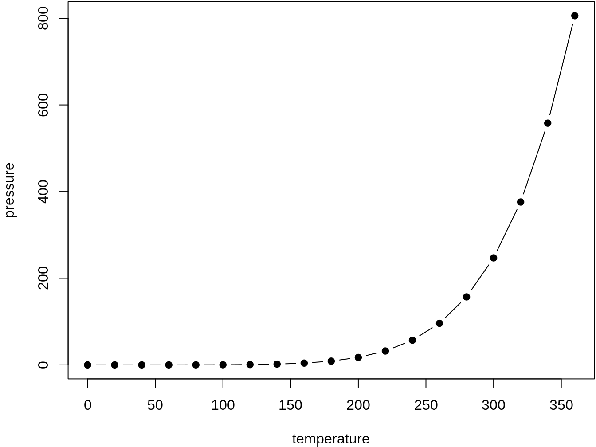

<a href="bookdown-cheat-sheet.html#content" class="sr-only sr-only-focusable">Skip to main content</a>

[Happy Git and GitHub for the useR](index.html)
===============================================

Show table of contents

Table of contents
-----------------

-   [Let’s Git started](index.html)
-   [1 Why Git? Why GitHub?](big-picture.html)
-   [2 Contributors](contrib.html)
-   [3 Workshops](workshops.html)
-   Installation
-   [Half the battle](install-intro.html)
-   [4 Register a GitHub account](github-acct.html)
-   [5 Install or upgrade R and RStudio](install-r-rstudio.html)
-   [6 Install Git](install-git.html)
-   [7 Introduce yourself to Git](hello-git.html)
-   [8 Install a Git client](git-client.html)
-   Connect Git, GitHub, RStudio
-   [Can you hear me now?](connect-intro.html)
-   [9 Personal access token for HTTPS](https-pat.html)
-   [10 Set up keys for SSH](ssh-keys.html)
-   [11 Connect to GitHub](push-pull-github.html)
-   [12 Connect RStudio to Git and GitHub](rstudio-git-github.html)
-   [13 Detect Git from RStudio](rstudio-see-git.html)
-   [14 RStudio, Git, GitHub Hell](troubleshooting.html)
-   Early GitHub Wins
-   [Get started with GitHub](usage-intro.html)
-   [15 New project, GitHub first](new-github-first.html)
-   [16 Existing project, GitHub first](existing-github-first.html)
-   [17 Existing project, GitHub last](existing-github-last.html)
-   [18 Test drive R Markdown](rmd-test-drive.html)
-   [19 Render an R script](r-test-drive.html)
-   Git fundamentals
-   [Some Git basics](git-intro.html)
-   [20 Repo, commit, diff, tag](git-basics.html)
-   [21 Git commands](git-commands.html)
-   [22 Branches](git-branches.html)
-   [23 Remotes](git-remotes.html)
-   Remote setups
-   [Git remote setups](remote-scenarios-intro.html)
-   [24 Common remote setups](common-remote-setups.html)
-   [25 Equivocal remote setups](equivocal.html)
-   Daily Workflows
-   [Useful Git patterns for real life](workflows-intro.html)
-   [26 The Repeated Amend](repeated-amend.html)
-   [27 Dealing with push rejection](push-rejected.html)
-   [28 Pull, but you have local work](pull-tricky.html)
-   [29 Time travel: See the past](time-travel-see-past.html)
-   [30 Fork and clone](fork-and-clone.html)
-   [31 Get upstream changes for a fork](upstream-changes.html)
-   [32 Explore and extend a pull request](pr-extend.html)
-   [33 Make a GitHub repo browsable](workflows-browsability.html)
-   Activity prompts
-   [34 Clone a repo](clone.html)
-   [35 Create a bingo card](bingo.html)
-   [36 Burn it all down](burn.html)
-   [37 Resetting](reset.html)
-   [38 Search GitHub](search.html)
-   Notes
-   [Notes](notes-intro.html)
-   [39 Run a course with GitHub](classroom-overview.html)
-   [40 Ideas for content](ideas-for-content.html)
-   <a href="bookdown-cheat-sheet.html" class="active">41 Bookdown cheat sheet</a>
-   Appendix
-   [A The shell](shell.html)
-   [B Comic relief](comic-relief.html)
-   [C Resources](resources.html)
-   [D References](references.html)

<a href="https://github.com/jennybc/happy-git-with-r" id="book-repo">View book source <em></em></a>

41 Bookdown cheat sheet<a href="bookdown-cheat-sheet.html#bookdown-cheat-sheet" class="anchor"><em></em></a>
=======================================================================================================================================================

Here’s where I park *little* *examples* **for myself** about bookdown mechanics that I keep forgetting.

The bookdown book: <a href="https://bookdown.org/yihui/bookdown/" class="uri">https://bookdown.org/yihui/bookdown/</a>

41.1 Heading blah blah<a href="bookdown-cheat-sheet.html#heading-blah-blah" class="anchor"><em></em></a>
---------------------------------------------------------------------------------------------------------------------------------------------------

41.2 About labelling things<a href="bookdown-cheat-sheet.html#id-example" class="anchor"><em></em></a>
-------------------------------------------------------------------------------------------------------------------------------------------------

You can label chapter and section titles using `{#label}` after them, e.g., we can reference Section [41.2](bookdown-cheat-sheet.html#id-example). If you do not manually label them, there will be automatic labels anyway, e.g., this reference to the unlabelled heading [41.1](bookdown-cheat-sheet.html#heading-blah-blah) uses the automatically generated label `\@ref(heading-blah-blah)`.

41.3 Cross-references<a href="bookdown-cheat-sheet.html#cross-references" class="anchor"><em></em></a>
-------------------------------------------------------------------------------------------------------------------------------------------------

Add an explicit label by adding `{#label}` to the end of the section header. If you know you’re going to refer to something, this is probably a good idea.

To refer to in a chapter- or section-number-y way, use `\@ref(label)`.

-   `\@ref(install-git)` example: In chapter [6](install-git.html#install-git) we explain how to install Git.

If you are happy with the section header as the link text, use it inside a single set of square brackets:

-   `[A picture is worth a thousand words]`: example “A picture is worth a thousand words” via [A picture is worth a thousand words](git-client.html#a-picture-is-worth-a-thousand-words)

There are two ways to specify custom link text:

-   `[link text][Section header text]`, e.g., “pic = 1000 words” via [pic = 1000 words](git-client.html#a-picture-is-worth-a-thousand-words)
-   `[link text](#label)`, e.g., “RStudio, meet Git” via [RStudio, meet Git](rstudio-see-git.html#rstudio-see-git)

The Pandoc documentation provides more details on automatic section IDs and implicit header references.

41.4 Figures, tables, citations<a href="bookdown-cheat-sheet.html#figures-tables-citations" class="anchor"><em></em></a>
-------------------------------------------------------------------------------------------------------------------------------------------------------------------

Figures and tables with captions will be placed in `figure` and `table` environments, respectively.

    par(mar = c(4, 4, .1, .1))
    plot(pressure, type = 'b', pch = 19)

 

Figure 41.1: Here is a nice figure!

Reference a figure by its code chunk label with the `fig:` prefix, e.g., see Figure [41.1](bookdown-cheat-sheet.html#fig:nice-fig). Similarly, you can reference tables generated from `knitr::kable()`, e.g., see Table [41.1](bookdown-cheat-sheet.html#tab:nice-tab).

    knitr::kable(
      head(iris, 20), caption = 'Here is a nice table!',
      booktabs = TRUE
    )

<table><caption> Table 41.1: Here is a nice table!</caption><thead><tr class="header"><th style="text-align: right;">Sepal.Length</th><th style="text-align: right;">Sepal.Width</th><th style="text-align: right;">Petal.Length</th><th style="text-align: right;">Petal.Width</th><th style="text-align: left;">Species</th></tr></thead><tbody><tr class="odd"><td style="text-align: right;">5.1</td><td style="text-align: right;">3.5</td><td style="text-align: right;">1.4</td><td style="text-align: right;">0.2</td><td style="text-align: left;">setosa</td></tr><tr class="even"><td style="text-align: right;">4.9</td><td style="text-align: right;">3.0</td><td style="text-align: right;">1.4</td><td style="text-align: right;">0.2</td><td style="text-align: left;">setosa</td></tr><tr class="odd"><td style="text-align: right;">4.7</td><td style="text-align: right;">3.2</td><td style="text-align: right;">1.3</td><td style="text-align: right;">0.2</td><td style="text-align: left;">setosa</td></tr><tr class="even"><td style="text-align: right;">4.6</td><td style="text-align: right;">3.1</td><td style="text-align: right;">1.5</td><td style="text-align: right;">0.2</td><td style="text-align: left;">setosa</td></tr><tr class="odd"><td style="text-align: right;">5.0</td><td style="text-align: right;">3.6</td><td style="text-align: right;">1.4</td><td style="text-align: right;">0.2</td><td style="text-align: left;">setosa</td></tr><tr class="even"><td style="text-align: right;">5.4</td><td style="text-align: right;">3.9</td><td style="text-align: right;">1.7</td><td style="text-align: right;">0.4</td><td style="text-align: left;">setosa</td></tr><tr class="odd"><td style="text-align: right;">4.6</td><td style="text-align: right;">3.4</td><td style="text-align: right;">1.4</td><td style="text-align: right;">0.3</td><td style="text-align: left;">setosa</td></tr><tr class="even"><td style="text-align: right;">5.0</td><td style="text-align: right;">3.4</td><td style="text-align: right;">1.5</td><td style="text-align: right;">0.2</td><td style="text-align: left;">setosa</td></tr><tr class="odd"><td style="text-align: right;">4.4</td><td style="text-align: right;">2.9</td><td style="text-align: right;">1.4</td><td style="text-align: right;">0.2</td><td style="text-align: left;">setosa</td></tr><tr class="even"><td style="text-align: right;">4.9</td><td style="text-align: right;">3.1</td><td style="text-align: right;">1.5</td><td style="text-align: right;">0.1</td><td style="text-align: left;">setosa</td></tr><tr class="odd"><td style="text-align: right;">5.4</td><td style="text-align: right;">3.7</td><td style="text-align: right;">1.5</td><td style="text-align: right;">0.2</td><td style="text-align: left;">setosa</td></tr><tr class="even"><td style="text-align: right;">4.8</td><td style="text-align: right;">3.4</td><td style="text-align: right;">1.6</td><td style="text-align: right;">0.2</td><td style="text-align: left;">setosa</td></tr><tr class="odd"><td style="text-align: right;">4.8</td><td style="text-align: right;">3.0</td><td style="text-align: right;">1.4</td><td style="text-align: right;">0.1</td><td style="text-align: left;">setosa</td></tr><tr class="even"><td style="text-align: right;">4.3</td><td style="text-align: right;">3.0</td><td style="text-align: right;">1.1</td><td style="text-align: right;">0.1</td><td style="text-align: left;">setosa</td></tr><tr class="odd"><td style="text-align: right;">5.8</td><td style="text-align: right;">4.0</td><td style="text-align: right;">1.2</td><td style="text-align: right;">0.2</td><td style="text-align: left;">setosa</td></tr><tr class="even"><td style="text-align: right;">5.7</td><td style="text-align: right;">4.4</td><td style="text-align: right;">1.5</td><td style="text-align: right;">0.4</td><td style="text-align: left;">setosa</td></tr><tr class="odd"><td style="text-align: right;">5.4</td><td style="text-align: right;">3.9</td><td style="text-align: right;">1.3</td><td style="text-align: right;">0.4</td><td style="text-align: left;">setosa</td></tr><tr class="even"><td style="text-align: right;">5.1</td><td style="text-align: right;">3.5</td><td style="text-align: right;">1.4</td><td style="text-align: right;">0.3</td><td style="text-align: left;">setosa</td></tr><tr class="odd"><td style="text-align: right;">5.7</td><td style="text-align: right;">3.8</td><td style="text-align: right;">1.7</td><td style="text-align: right;">0.3</td><td style="text-align: left;">setosa</td></tr><tr class="even"><td style="text-align: right;">5.1</td><td style="text-align: right;">3.8</td><td style="text-align: right;">1.5</td><td style="text-align: right;">0.3</td><td style="text-align: left;">setosa</td></tr></tbody></table>

You can write citations, too. For example, we are using the **bookdown** package (Xie [2021](references.html#ref-R-bookdown)) in this sample book, which was built on top of R Markdown and **knitr** (Xie [2015](references.html#ref-knitr-book)).

41.5 How the square bracket links work<a href="bookdown-cheat-sheet.html#how-the-square-bracket-links-work" class="anchor"><em></em></a>
-----------------------------------------------------------------------------------------------------------------------------------------------------------------------------------

Context: you prefer to link with text, not a chapter or section number.

-   GOOD! Here’s a link to [Contributors](contrib.html#contrib).
-   BAD. You can see contributors in [2](contrib.html#contrib).

Facts and vocabulary

-   Each chapter is a file. These files should begin with the chapter title using a level-one header, e.g., `# Chapter Title`.
-   A chapter can be made up of sections, indicated by lower-level headers, e.g., `## A section within the chapter`.
-   There are three ways to address a section when creating links within your book:
    -   **Explicit identifier**: In `# My header {#foo}` the explicit identifier is `foo`.
    -   **Automatically generated identifier**: `my-header` is the auto-identifier for `# My header`. Pandoc creates auto-identifiers according to rules laid out in [Extension: auto\_identifiers](http://pandoc.org/README.html#extension-auto_identifiers).
    -   The header text, e.g., `My header` be used verbatim as an **implicit header reference**. See [Extension: implicit\_header\_references](http://pandoc.org/README.html#extension-implicit_header_references) for more.
-   All 3 forms can be used to create cross-references but you build the links differently.
-   Advantage of explicit identification: You are less likely to update the section header and then forget to make matching edits to references elsewhere in the book.

How to make text-based links using explicit identifiers, automatic identifiers, and implicit references:

-   Use implicit reference alone to get a link where the text is exactly the section header:
    -   `[Introduce yourself to Git]` [Introduce yourself to Git](hello-git.html#hello-git)
    -   `[Success and operating systems]` [Success and operating systems](install-intro.html#success-and-operating-systems)
-   You can provide custom text for the link with all 3 methods of addressing a section:
    -   Implicit header reference: `[link text][Recommended Git clients]` [link text](git-client.html#recommended-git-clients)  
    -   Explicit identifier: `[hello git! I'm Jenny](#hello-git)` [hello git! I’m Jenny](hello-git.html#hello-git)
    -   Automatic identifier: `[Any text you want](#recommended-git-clients)` [Any text you want](git-client.html#recommended-git-clients)

[40 Ideas for content](ideas-for-content.html)

[A The shell](shell.html)

On this page
------------

-   <a href="bookdown-cheat-sheet.html#bookdown-cheat-sheet" class="nav-link">41 Bookdown cheat sheet</a>
-   <a href="bookdown-cheat-sheet.html#heading-blah-blah" class="nav-link">41.1 Heading blah blah</a>
-   <a href="bookdown-cheat-sheet.html#id-example" class="nav-link">41.2 About labelling things</a>
-   <a href="bookdown-cheat-sheet.html#cross-references" class="nav-link">41.3 Cross-references</a>
-   <a href="bookdown-cheat-sheet.html#figures-tables-citations" class="nav-link">41.4 Figures, tables, citations</a>
-   <a href="bookdown-cheat-sheet.html#how-the-square-bracket-links-work" class="nav-link">41.5 How the square bracket links work</a>

-   <a href="https://github.com/jennybc/happy-git-with-r/blob/master/notes-bookdown-cheat-sheet.Rmd" id="book-source">View source <em></em></a>
-   <a href="https://github.com/jennybc/happy-git-with-r/edit/master/notes-bookdown-cheat-sheet.Rmd" id="book-edit">Edit this page <em></em></a>
