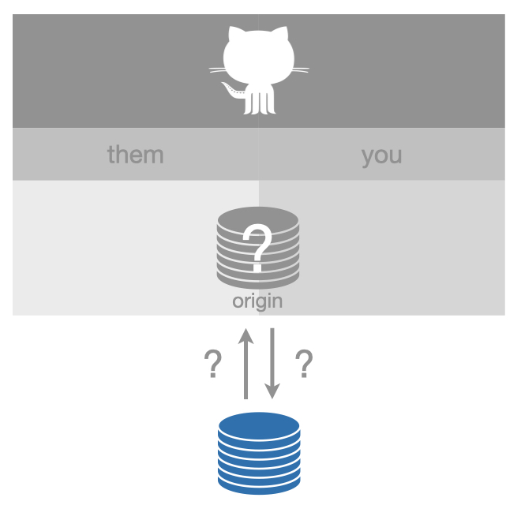
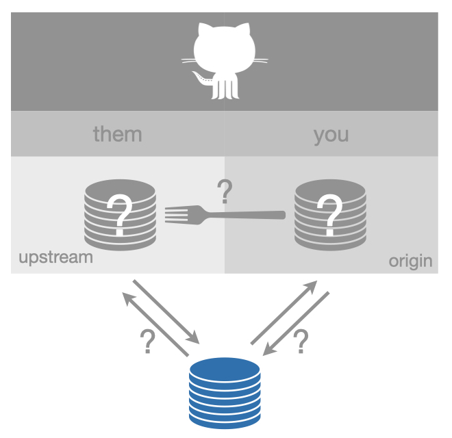

<a href="equivocal.html#content" class="sr-only sr-only-focusable">Skip to main content</a>

[Happy Git and GitHub for the useR](index.html)
===============================================

Show table of contents

Table of contents
-----------------

-   [Let’s Git started](index.html)
-   [1 Why Git? Why GitHub?](big-picture.html)
-   [2 Contributors](contrib.html)
-   [3 Workshops](workshops.html)
-   Installation
-   [Half the battle](install-intro.html)
-   [4 Register a GitHub account](github-acct.html)
-   [5 Install or upgrade R and RStudio](install-r-rstudio.html)
-   [6 Install Git](install-git.html)
-   [7 Introduce yourself to Git](hello-git.html)
-   [8 Install a Git client](git-client.html)
-   Connect Git, GitHub, RStudio
-   [Can you hear me now?](connect-intro.html)
-   [9 Personal access token for HTTPS](https-pat.html)
-   [10 Set up keys for SSH](ssh-keys.html)
-   [11 Connect to GitHub](push-pull-github.html)
-   [12 Connect RStudio to Git and GitHub](rstudio-git-github.html)
-   [13 Detect Git from RStudio](rstudio-see-git.html)
-   [14 RStudio, Git, GitHub Hell](troubleshooting.html)
-   Early GitHub Wins
-   [Get started with GitHub](usage-intro.html)
-   [15 New project, GitHub first](new-github-first.html)
-   [16 Existing project, GitHub first](existing-github-first.html)
-   [17 Existing project, GitHub last](existing-github-last.html)
-   [18 Test drive R Markdown](rmd-test-drive.html)
-   [19 Render an R script](r-test-drive.html)
-   Git fundamentals
-   [Some Git basics](git-intro.html)
-   [20 Repo, commit, diff, tag](git-basics.html)
-   [21 Git commands](git-commands.html)
-   [22 Branches](git-branches.html)
-   [23 Remotes](git-remotes.html)
-   Remote setups
-   [Git remote setups](remote-scenarios-intro.html)
-   [24 Common remote setups](common-remote-setups.html)
-   <a href="equivocal.html" class="active">25 Equivocal remote setups</a>
-   Daily Workflows
-   [Useful Git patterns for real life](workflows-intro.html)
-   [26 The Repeated Amend](repeated-amend.html)
-   [27 Dealing with push rejection](push-rejected.html)
-   [28 Pull, but you have local work](pull-tricky.html)
-   [29 Time travel: See the past](time-travel-see-past.html)
-   [30 Fork and clone](fork-and-clone.html)
-   [31 Get upstream changes for a fork](upstream-changes.html)
-   [32 Explore and extend a pull request](pr-extend.html)
-   [33 Make a GitHub repo browsable](workflows-browsability.html)
-   Activity prompts
-   [34 Clone a repo](clone.html)
-   [35 Create a bingo card](bingo.html)
-   [36 Burn it all down](burn.html)
-   [37 Resetting](reset.html)
-   [38 Search GitHub](search.html)
-   Notes
-   [Notes](notes-intro.html)
-   [39 Run a course with GitHub](classroom-overview.html)
-   [40 Ideas for content](ideas-for-content.html)
-   [41 Bookdown cheat sheet](bookdown-cheat-sheet.html)
-   Appendix
-   [A The shell](shell.html)
-   [B Comic relief](comic-relief.html)
-   [C Resources](resources.html)
-   [D References](references.html)

<a href="https://github.com/jennybc/happy-git-with-r" id="book-repo">View book source <em></em></a>

25 Equivocal remote setups<a href="equivocal.html#equivocal" class="anchor"><em></em></a>
====================================================================================================================================

Just like the previous section about the most common setups, we only consider a very constrained set of remotes:

-   The remote is on GitHub, e.g. its URL looks something like `https://github.com/OWNER/REPO.git` or `git@github.com:OWNER/REPO.git`.
-   The remote is named `origin` or `upstream`.

The setups described here are characterized by *incomplete information*. This section exists mostly to explain feedback that the usethis package might give about a GitHub remote configuration.

To identify any of the remote setups described in section [24](common-remote-setups.html#common-remote-setups), we need information from GitHub:

-   Whether you can push to a repo
-   Whether a repo is a fork
-   For a fork, what is its source repo

Sometimes some of this information is publicly available, but some of it never is, such as repo permissions. This means that programmatic access to this information, i.e. requests to the GitHub API, generally requires authorization by an authenticated GitHub user.

This means that client packages, like usethis, work best when you have configured a GitHub personal access token (PAT). See section [9.3](https-pat.html#get-a-pat) for more details on why and how to do that.

If you’ve configured a PAT and are being told your GitHub config is problematic, consider these other explanations: Are you offline? Is GitHub down? Has your PAT expired? By default, they now expire after 30 days.

25.1 Maybe “ours” or “theirs”<a href="equivocal.html#maybe-ours-or-theirs" class="anchor"><em></em></a>
--------------------------------------------------------------------------------------------------------------------------------------------------

When we detect just one GitHub remote, but we can’t verify the info above, usethis describes the setup as “maybe\_ours\_or\_theirs”.

Once a PAT is available, this setup can be identified as being [“ours” (belonging to you)](common-remote-setups.html#ours-you), [“ours” (but belonging to someone else)](common-remote-setups.html#ours-them), or [“theirs”](common-remote-setups.html#theirs).

25.2 Maybe fork<a href="equivocal.html#maybe-fork" class="anchor"><em></em></a>
--------------------------------------------------------------------------------------------------------------------------

When we detect two GitHub remotes, but we can’t verify the info above, usethis describes the setup as “maybe\_fork”.

Once a PAT is available, this setup can be identified as being a well-configured [fork](common-remote-setups.html#fork-them) or a [fork with incomplete setup](common-remote-setups.html#fork_upstream_is_not_origin_parent) (or possibly something more weird).

25.3 How to fix<a href="equivocal.html#how-to-fix" class="anchor"><em></em></a>
--------------------------------------------------------------------------------------------------------------------------

These setups aren’t necessarily broken, but usethis needs more information to operate.

To “fix” this, set up a GitHub personal access token. See section [9.3](https-pat.html#get-a-pat) for more details on why and how to do that.

[24 Common remote setups](common-remote-setups.html)

[Useful Git patterns for real life](workflows-intro.html)

On this page
------------

-   <a href="equivocal.html#equivocal" class="nav-link">25 Equivocal remote setups</a>
-   <a href="equivocal.html#maybe-ours-or-theirs" class="nav-link">25.1 Maybe “ours” or “theirs”</a>
-   <a href="equivocal.html#maybe-fork" class="nav-link">25.2 Maybe fork</a>
-   <a href="equivocal.html#how-to-fix" class="nav-link">25.3 How to fix</a>

-   <a href="https://github.com/jennybc/happy-git-with-r/blob/master/remote-setups-equivocal.Rmd" id="book-source">View source <em></em></a>
-   <a href="https://github.com/jennybc/happy-git-with-r/edit/master/remote-setups-equivocal.Rmd" id="book-edit">Edit this page <em></em></a>
