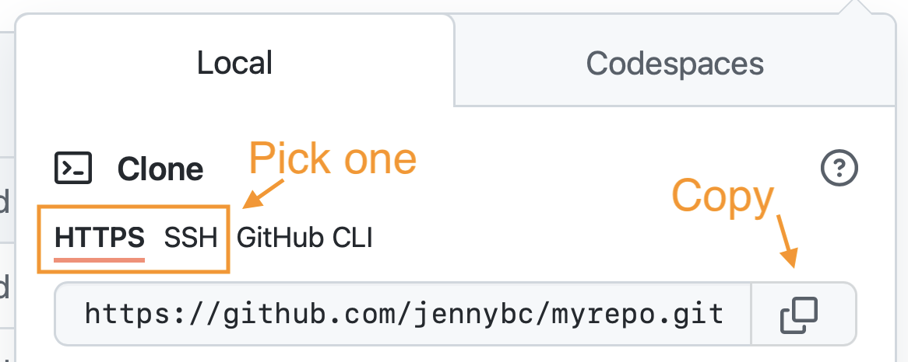

<a href="existing-github-first.html#content" class="sr-only sr-only-focusable">Skip to main content</a>

[Happy Git and GitHub for the useR](index.html)
===============================================

Show table of contents

Table of contents
-----------------

-   [Let’s Git started](index.html)
-   [1 Why Git? Why GitHub?](big-picture.html)
-   [2 Contributors](contrib.html)
-   [3 Workshops](workshops.html)
-   Installation
-   [Half the battle](install-intro.html)
-   [4 Register a GitHub account](github-acct.html)
-   [5 Install or upgrade R and RStudio](install-r-rstudio.html)
-   [6 Install Git](install-git.html)
-   [7 Introduce yourself to Git](hello-git.html)
-   [8 Install a Git client](git-client.html)
-   Connect Git, GitHub, RStudio
-   [Can you hear me now?](connect-intro.html)
-   [9 Personal access token for HTTPS](https-pat.html)
-   [10 Set up keys for SSH](ssh-keys.html)
-   [11 Connect to GitHub](push-pull-github.html)
-   [12 Connect RStudio to Git and GitHub](rstudio-git-github.html)
-   [13 Detect Git from RStudio](rstudio-see-git.html)
-   [14 RStudio, Git, GitHub Hell](troubleshooting.html)
-   Early GitHub Wins
-   [Get started with GitHub](usage-intro.html)
-   [15 New project, GitHub first](new-github-first.html)
-   <a href="existing-github-first.html" class="active">16 Existing project, GitHub first</a>
-   [17 Existing project, GitHub last](existing-github-last.html)
-   [18 Test drive R Markdown](rmd-test-drive.html)
-   [19 Render an R script](r-test-drive.html)
-   Git fundamentals
-   [Some Git basics](git-intro.html)
-   [20 Repo, commit, diff, tag](git-basics.html)
-   [21 Git commands](git-commands.html)
-   [22 Branches](git-branches.html)
-   [23 Remotes](git-remotes.html)
-   Remote setups
-   [Git remote setups](remote-scenarios-intro.html)
-   [24 Common remote setups](common-remote-setups.html)
-   [25 Equivocal remote setups](equivocal.html)
-   Daily Workflows
-   [Useful Git patterns for real life](workflows-intro.html)
-   [26 The Repeated Amend](repeated-amend.html)
-   [27 Dealing with push rejection](push-rejected.html)
-   [28 Pull, but you have local work](pull-tricky.html)
-   [29 Time travel: See the past](time-travel-see-past.html)
-   [30 Fork and clone](fork-and-clone.html)
-   [31 Get upstream changes for a fork](upstream-changes.html)
-   [32 Explore and extend a pull request](pr-extend.html)
-   [33 Make a GitHub repo browsable](workflows-browsability.html)
-   Activity prompts
-   [34 Clone a repo](clone.html)
-   [35 Create a bingo card](bingo.html)
-   [36 Burn it all down](burn.html)
-   [37 Resetting](reset.html)
-   [38 Search GitHub](search.html)
-   Notes
-   [Notes](notes-intro.html)
-   [39 Run a course with GitHub](classroom-overview.html)
-   [40 Ideas for content](ideas-for-content.html)
-   [41 Bookdown cheat sheet](bookdown-cheat-sheet.html)
-   Appendix
-   [A The shell](shell.html)
-   [B Comic relief](comic-relief.html)
-   [C Resources](resources.html)
-   [D References](references.html)

<a href="https://github.com/jennybc/happy-git-with-r" id="book-repo">View book source <em></em></a>

16 Existing project, GitHub first<a href="existing-github-first.html#existing-github-first" class="anchor"><em></em></a>
===================================================================================================================================================================

This is a novice-friendly workflow for bringing an existing R project into the RStudio and Git/GitHub universe.

We do this in a slightly goofy way, in order to avoid using Git at the command line. You won’t want to work this way forever, but it’s perfectly fine as you’re getting started! At first, the main goal is to accumulate some experience and momentum. There is nothing goofy about the GitHub repo that this creates, it is completely standard. Transition to a more elegant process when you’re ready.

We assume you’ve got your existing R project isolated in a directory on your computer. If that’s not already true, make it so. Create a directory and marshal all the existing data and R scripts there. It doesn’t really matter where you do this, but note where the project currently lives.

16.1 Make a repo on GitHub<a href="existing-github-first.html#make-a-repo-on-github-3" class="anchor"><em></em></a>
--------------------------------------------------------------------------------------------------------------------------------------------------------------

Go to <a href="https://github.com" class="uri">https://github.com</a> and make sure you are logged in.

Near “Repositories”, click the big green “New” button. Or, if you are on your own profile page, click on “Repositories”, then click the big green “New” button.

How to fill this in:

-   Repository template: No template.
-   Repository name: `myrepo` or a similarly short name for this existing project. Approach this similar to a variable name, in code: descriptive but brief, no whitespace. Letters, digits, `-`, `.`, or `_` are allowed.
-   Description: “Analysis of the stuff” or any short description of the project. Write this for humans.
-   Public.
-   Initialize this repository with: Add a README file.

Click the big green button that says “Create repository”.

Now click the big green button that says “&lt;&gt; Code”.

Copy a clone URL to your clipboard. If you’re taking our default advice, copy the HTTPS URL. But if you’re opting for SSH, then make sure to copy the SSH URL.

16.2 New RStudio Project via `git clone`<a href="existing-github-first.html#new-rstudio-project-via-git-clone" class="anchor"><em></em></a>
--------------------------------------------------------------------------------------------------------------------------------------------------------------------------------------

In RStudio, start a new Project:

-   *File &gt; New Project &gt; Version Control &gt; Git*. In the “repository URL” paste the URL of your new GitHub repository. It will be something like this `https://github.com/jennybc/myrepo.git`.
-   Be intentional about where you create this Project.
-   I suggest you “Open in new session”.
-   Click “Create Project” to create a new directory, which will be all of these things:
    -   a directory or “folder” on your computer
    -   a Git repository, linked to a remote GitHub repository
    -   an RStudio Project
-   **In the absence of other constraints, I suggest that all of your R projects have exactly this set-up.**

This should download the `README.md` file that we created on GitHub in the previous step. Look in RStudio’s file browser pane for the `README.md` file.

Behind the scenes, RStudio has done this for you:

    git clone https://github.com/jennybc/myrepo.git

16.3 Bring your existing project over<a href="existing-github-first.html#bring-your-existing-project-over" class="anchor"><em></em></a>
----------------------------------------------------------------------------------------------------------------------------------------------------------------------------------

Using your favorite method of moving or copying files, copy the files that constitute your existing project into the directory for this new project.

In RStudio, consult the Git pane and the file browser.

-   Are you seeing all the files? They should be here if your move/copy was successful.
-   Are they showing up in the Git pane with questions marks? They should be appearing as new untracked files.

16.4 Stage and commit<a href="existing-github-first.html#stage-and-commit" class="anchor"><em></em></a>
--------------------------------------------------------------------------------------------------------------------------------------------------

Commit your files to this repo. How?

-   Click the “Git” tab in upper right pane
-   Check the “Staged” box for all files that you want to commit.
    -   Default: stage it.
    -   When to reconsider: this will all go to GitHub. Consider if that is appropriate for each file. **You can absolutely keep a file locally, without committing it to the Git repo and sending to GitHub**. Just let it sit there in your Git pane, without being staged. No harm will be done. If this is a long-term situation, list the file in `.gitignore`.
-   If you’re not already in the Git pop-up, click “Commit”
-   Type a message in “Commit message”, such as “Init project XYZ”.
-   Click “Commit”

16.5 Push your local changes to GitHub<a href="existing-github-first.html#push-your-local-changes-to-github-1" class="anchor"><em></em></a>
--------------------------------------------------------------------------------------------------------------------------------------------------------------------------------------

Click the green “Push” button to send your local changes to GitHub. RStudio will display something like:

    >>> /usr/bin/git push origin HEAD:refs/heads/main
    To https://github.com/jennybc/myrepo.git
       3a2171f..6d58539  HEAD -> main

16.6 Confirm the local change propagated to the GitHub remote<a href="existing-github-first.html#confirm-the-local-change-propagated-to-the-github-remote-3" class="anchor"><em></em></a>
------------------------------------------------------------------------------------------------------------------------------------------------------------------------------------------------------------------------------------

Go back to the browser. I assume we’re still viewing your new GitHub repo.

Refresh.

You should see all the project files you committed there.

If you click on “commits,” you should see one with the message you used, e.g. “Init project XYZ”.

Now just “lather, rinse, repeat”. Do work somewhere: locally or on GitHub. Commit it. Push it or pull it, depending on where you did the work, but get local and remote “synced up”. Repeat.

Note that in general (and especially in future when collaborating with other developers) you will usually need to pull changes from the remote (GitHub) before pushing the local changes you have made. For this reason, it’s a good idea to try and get into the habit of pulling before you attempt to push.

[15 New project, GitHub first](new-github-first.html)

[17 Existing project, GitHub last](existing-github-last.html)

On this page
------------

-   <a href="existing-github-first.html#existing-github-first" class="nav-link">16 Existing project, GitHub first</a>
-   <a href="existing-github-first.html#make-a-repo-on-github-3" class="nav-link">16.1 Make a repo on GitHub</a>
-   <a href="existing-github-first.html#new-rstudio-project-via-git-clone" class="nav-link">16.2 New RStudio Project via git clone</a>
-   <a href="existing-github-first.html#bring-your-existing-project-over" class="nav-link">16.3 Bring your existing project over</a>
-   <a href="existing-github-first.html#stage-and-commit" class="nav-link">16.4 Stage and commit</a>
-   <a href="existing-github-first.html#push-your-local-changes-to-github-1" class="nav-link">16.5 Push your local changes to GitHub</a>
-   <a href="existing-github-first.html#confirm-the-local-change-propagated-to-the-github-remote-3" class="nav-link">16.6 Confirm the local change propagated to the GitHub remote</a>

-   <a href="https://github.com/jennybc/happy-git-with-r/blob/master/usage-existing-project-github-first.Rmd" id="book-source">View source <em></em></a>
-   <a href="https://github.com/jennybc/happy-git-with-r/edit/master/usage-existing-project-github-first.Rmd" id="book-edit">Edit this page <em></em></a>
