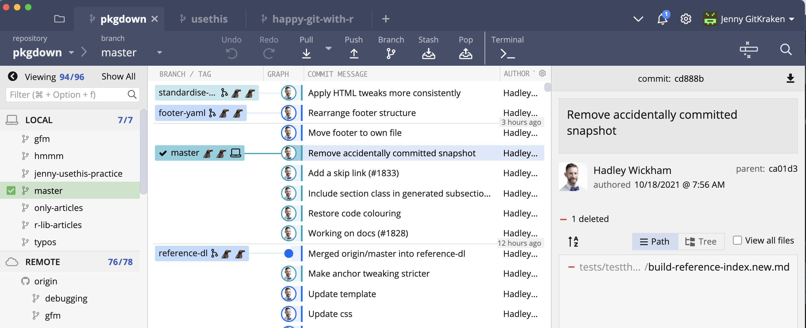

<a href="git-client.html#content" class="sr-only sr-only-focusable">Skip to main content</a>

[Happy Git and GitHub for the useR](index.html)
===============================================

Show table of contents

Table of contents
-----------------

-   [Let’s Git started](index.html)
-   [1 Why Git? Why GitHub?](big-picture.html)
-   [2 Contributors](contrib.html)
-   [3 Workshops](workshops.html)
-   Installation
-   [Half the battle](install-intro.html)
-   [4 Register a GitHub account](github-acct.html)
-   [5 Install or upgrade R and RStudio](install-r-rstudio.html)
-   [6 Install Git](install-git.html)
-   [7 Introduce yourself to Git](hello-git.html)
-   <a href="git-client.html" class="active">8 Install a Git client</a>
-   Connect Git, GitHub, RStudio
-   [Can you hear me now?](connect-intro.html)
-   [9 Personal access token for HTTPS](https-pat.html)
-   [10 Set up keys for SSH](ssh-keys.html)
-   [11 Connect to GitHub](push-pull-github.html)
-   [12 Connect RStudio to Git and GitHub](rstudio-git-github.html)
-   [13 Detect Git from RStudio](rstudio-see-git.html)
-   [14 RStudio, Git, GitHub Hell](troubleshooting.html)
-   Early GitHub Wins
-   [Get started with GitHub](usage-intro.html)
-   [15 New project, GitHub first](new-github-first.html)
-   [16 Existing project, GitHub first](existing-github-first.html)
-   [17 Existing project, GitHub last](existing-github-last.html)
-   [18 Test drive R Markdown](rmd-test-drive.html)
-   [19 Render an R script](r-test-drive.html)
-   Git fundamentals
-   [Some Git basics](git-intro.html)
-   [20 Repo, commit, diff, tag](git-basics.html)
-   [21 Git commands](git-commands.html)
-   [22 Branches](git-branches.html)
-   [23 Remotes](git-remotes.html)
-   Remote setups
-   [Git remote setups](remote-scenarios-intro.html)
-   [24 Common remote setups](common-remote-setups.html)
-   [25 Equivocal remote setups](equivocal.html)
-   Daily Workflows
-   [Useful Git patterns for real life](workflows-intro.html)
-   [26 The Repeated Amend](repeated-amend.html)
-   [27 Dealing with push rejection](push-rejected.html)
-   [28 Pull, but you have local work](pull-tricky.html)
-   [29 Time travel: See the past](time-travel-see-past.html)
-   [30 Fork and clone](fork-and-clone.html)
-   [31 Get upstream changes for a fork](upstream-changes.html)
-   [32 Explore and extend a pull request](pr-extend.html)
-   [33 Make a GitHub repo browsable](workflows-browsability.html)
-   Activity prompts
-   [34 Clone a repo](clone.html)
-   [35 Create a bingo card](bingo.html)
-   [36 Burn it all down](burn.html)
-   [37 Resetting](reset.html)
-   [38 Search GitHub](search.html)
-   Notes
-   [Notes](notes-intro.html)
-   [39 Run a course with GitHub](classroom-overview.html)
-   [40 Ideas for content](ideas-for-content.html)
-   [41 Bookdown cheat sheet](bookdown-cheat-sheet.html)
-   Appendix
-   [A The shell](shell.html)
-   [B Comic relief](comic-relief.html)
-   [C Resources](resources.html)
-   [D References](references.html)

<a href="https://github.com/jennybc/happy-git-with-r" id="book-repo">View book source <em></em></a>

8 Install a Git client<a href="git-client.html#git-client" class="anchor"><em></em></a>
==================================================================================================================================

This is optional but **highly recommended**.

Learning to use version control can be rough at first. I found the use of a GUI – as opposed to the command line – extremely helpful when I was getting started. I call this sort of helper application a Git client. It’s really a Git(Hub) client because it also helps you interact with GitHub or other remotes.

A Git client is not required for live workshops and will not be explicitly taught, though you might see us using one of these clients.

8.1 What is a Git client? Why would you want one?<a href="git-client.html#what-is-a-git-client-why-would-you-want-one" class="anchor"><em></em></a>
----------------------------------------------------------------------------------------------------------------------------------------------------------------------------------------------

“Git” is really just a collection of individual commands you execute in the shell (Appendix [A](shell.html#shell)). This interface is not appealing for everyone. Some may prefer to do Git operations via a client with a graphical interface.

Git and your Git client are not the same thing, just like R and RStudio are not the same thing. A Git client and an [integrated development environment](https://en.wikipedia.org/wiki/Integrated_development_environment), such as RStudio, are not necessary to use Git or R, respectively. But they make the experience more pleasant because they reduce the amount of “command line bullshittery”1 and provide a richer visual representation of the current state.

RStudio offers a very basic Git client via its Git pane. I use this often for simple operations, but you probably want another, more powerful one as well.

Fair warning: for some tasks, you must use the command line. But the more powerful your Git client is, the less often this happens. The visual overview given by your Git client can also be invaluable for understanding the current state of things, even when preparing calls to command line Git.

Fantastic news: because all of the clients are just forming and executing Git commands on your behalf, you don’t have to pick one. You can literally do one operation from the command line, do another from RStudio, and another from GitKraken, one after the other, and it just works. *Very rarely, both clients will scan the repo at the same time and you’ll get an error message about `.git/index.lock`. Try the operation again at least once before doing any further troubleshooting.*

8.2 A picture is worth a thousand words<a href="git-client.html#a-picture-is-worth-a-thousand-words" class="anchor"><em></em></a>
----------------------------------------------------------------------------------------------------------------------------------------------------------------------------

Here’s a screenshot of GitKraken (see below) open to the repository for the R package [pkgdown](https://pkgdown.r-lib.org). You get a nice graphical overview of the recent commit history, branches, and diffs, as well as a GUI that facilitates the most common Git operations.

In contrast, here’s a shell session where I’ve used command line Git to access some of the same information.

    jenny@jennys-MacBook-Pro pkgdown % git log --oneline -n 10
    cd888bed (HEAD -> master, upstream/master, upstream/HEAD, r-lib/master, r-lib/HEAD) Remove accidentally committed snapshot
    ca01d386 Add a skip link (#1833)
    1f07a145 Include section class in generated subsection divs
    26e1dcf2 Restore code colouring
    77503979 Working on docs (#1828)
    3c805e1a Make anchor tweaking stricter
    a6ae3ca4 use_tidy_description()
    d43260fb Tweak authors order
    41c855df Tweak details styling
    7d3c484c Anchor & news tweaks (#1830)

Which do you prefer?

8.3 No one is giving out Git Nerd merit badges<a href="git-client.html#no-one-is-giving-out-git-nerd-merit-badges" class="anchor"><em></em></a>
------------------------------------------------------------------------------------------------------------------------------------------------------------------------------------------

Work with Git in whatever way makes you most effective. Feel free to revisit your approach over time or to use different approaches for different tasks or in different settings. No one can tell whether you use the command line or a GUI when they look at your Git history or your GitHub repo.

I sometimes encounter people who feel it’s “better” to use command line Git, but for very ill-defined reasons. These people may feel like they *should* work in the shell, even if it leads to Git-avoidance, frequent mistakes, or limiting themselves to a small set of ~3 Git commands. This is counterproductive.

I had two false starts with Git, where I failed to get proficient enough, quickly enough to truly incorporate version control into my daily work. I found a visual Git client invaluable – SourceTree, at the time. It made me willing to use Git multiple times per day, for a sustained period of time. This helped me build the mental model necessary for more advanced Git operations like rebasing, cherry-picking, and resetting.

If your Git life happens on your own computer, there is no reason to deny yourself a GUI if that’s what you like. If you prefer working in the shell or if you frequently log into a remote server, then it makes sense to prioritize building Git skills at the command line. Do whatever works for you, but don’t do anything for the sake of purity or heroism.

8.4 Recommended Git clients<a href="git-client.html#recommended-git-clients" class="anchor"><em></em></a>
----------------------------------------------------------------------------------------------------------------------------------------------------

-   [GitKraken](https://www.gitkraken.com) is a free, powerful Git(Hub) client that is my current favorite. It’s especially exciting because it works on Windows, macOS, and Linux. This is great news, especially for long-suffering Linux users who previously had very few options. I used the free for version for years, which works great, but now I happily pay money for the pro version.

-   [SourceTree](https://www.sourcetreeapp.com) is another free client that I used to highly recommend. It was my first beloved Git client, but I eventually had to give it up, due to long-standing bugs / deficiencies that seemed like they would never be fixed ([macOS bug re: leaking file handles](http://openradar.appspot.com/radar?id=1387401), no ability to control font size). GitKraken feels much more actively developed and has completely supplanted SourceTree for me.

-   GitHub offers a free Git(Hub) client, [GitHub Desktop](https://desktop.github.com/), for Windows and macOS. Although we previously discouraged its use, GitHub’s client has since gotten a thorough makeover that eliminates several of our concerns, so we’re cautiously optimistic. GitHub Desktop is aimed at beginners who want the most useful features of Git front and center. The flipside is that it may not support some of the more advanced workflows exposed by the clients above and, consequently, may not develop your mental model of Git as thoroughly.

-   Browse [even more Git(Hub) clients](http://git-scm.com/downloads/guis).

[7 Introduce yourself to Git](hello-git.html)

[Can you hear me now?](connect-intro.html)

On this page
------------

-   <a href="git-client.html#git-client" class="nav-link">8 Install a Git client</a>
-   <a href="git-client.html#what-is-a-git-client-why-would-you-want-one" class="nav-link">8.1 What is a Git client? Why would you want one?</a>
-   <a href="git-client.html#a-picture-is-worth-a-thousand-words" class="nav-link">8.2 A picture is worth a thousand words</a>
-   <a href="git-client.html#no-one-is-giving-out-git-nerd-merit-badges" class="nav-link">8.3 No one is giving out Git Nerd merit badges</a>
-   <a href="git-client.html#recommended-git-clients" class="nav-link">8.4 Recommended Git clients</a>

-   <a href="https://github.com/jennybc/happy-git-with-r/blob/master/install-git-client.Rmd" id="book-source">View source <em></em></a>
-   <a href="https://github.com/jennybc/happy-git-with-r/edit/master/install-git-client.Rmd" id="book-edit">Edit this page <em></em></a>
