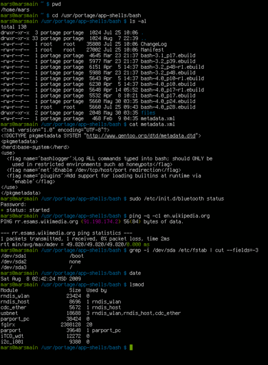
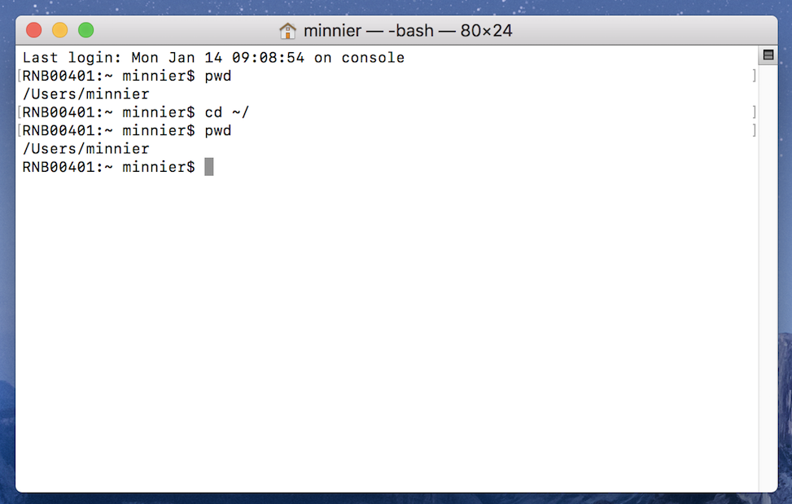
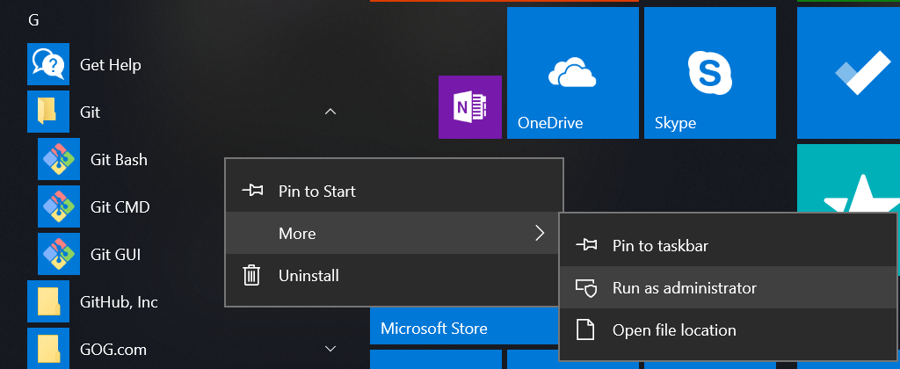

<a href="shell.html#content" class="sr-only sr-only-focusable">Skip to main content</a>

[Happy Git and GitHub for the useR](index.html)
===============================================

Show table of contents

Table of contents
-----------------

-   [Let’s Git started](index.html)
-   [1 Why Git? Why GitHub?](big-picture.html)
-   [2 Contributors](contrib.html)
-   [3 Workshops](workshops.html)
-   Installation
-   [Half the battle](install-intro.html)
-   [4 Register a GitHub account](github-acct.html)
-   [5 Install or upgrade R and RStudio](install-r-rstudio.html)
-   [6 Install Git](install-git.html)
-   [7 Introduce yourself to Git](hello-git.html)
-   [8 Install a Git client](git-client.html)
-   Connect Git, GitHub, RStudio
-   [Can you hear me now?](connect-intro.html)
-   [9 Personal access token for HTTPS](https-pat.html)
-   [10 Set up keys for SSH](ssh-keys.html)
-   [11 Connect to GitHub](push-pull-github.html)
-   [12 Connect RStudio to Git and GitHub](rstudio-git-github.html)
-   [13 Detect Git from RStudio](rstudio-see-git.html)
-   [14 RStudio, Git, GitHub Hell](troubleshooting.html)
-   Early GitHub Wins
-   [Get started with GitHub](usage-intro.html)
-   [15 New project, GitHub first](new-github-first.html)
-   [16 Existing project, GitHub first](existing-github-first.html)
-   [17 Existing project, GitHub last](existing-github-last.html)
-   [18 Test drive R Markdown](rmd-test-drive.html)
-   [19 Render an R script](r-test-drive.html)
-   Git fundamentals
-   [Some Git basics](git-intro.html)
-   [20 Repo, commit, diff, tag](git-basics.html)
-   [21 Git commands](git-commands.html)
-   [22 Branches](git-branches.html)
-   [23 Remotes](git-remotes.html)
-   Remote setups
-   [Git remote setups](remote-scenarios-intro.html)
-   [24 Common remote setups](common-remote-setups.html)
-   [25 Equivocal remote setups](equivocal.html)
-   Daily Workflows
-   [Useful Git patterns for real life](workflows-intro.html)
-   [26 The Repeated Amend](repeated-amend.html)
-   [27 Dealing with push rejection](push-rejected.html)
-   [28 Pull, but you have local work](pull-tricky.html)
-   [29 Time travel: See the past](time-travel-see-past.html)
-   [30 Fork and clone](fork-and-clone.html)
-   [31 Get upstream changes for a fork](upstream-changes.html)
-   [32 Explore and extend a pull request](pr-extend.html)
-   [33 Make a GitHub repo browsable](workflows-browsability.html)
-   Activity prompts
-   [34 Clone a repo](clone.html)
-   [35 Create a bingo card](bingo.html)
-   [36 Burn it all down](burn.html)
-   [37 Resetting](reset.html)
-   [38 Search GitHub](search.html)
-   Notes
-   [Notes](notes-intro.html)
-   [39 Run a course with GitHub](classroom-overview.html)
-   [40 Ideas for content](ideas-for-content.html)
-   [41 Bookdown cheat sheet](bookdown-cheat-sheet.html)
-   Appendix
-   <a href="shell.html" class="active">A The shell</a>
-   [B Comic relief](comic-relief.html)
-   [C Resources](resources.html)
-   [D References](references.html)

<a href="https://github.com/jennybc/happy-git-with-r" id="book-repo">View book source <em></em></a>

A The shell<a href="shell.html#shell" class="anchor"><em></em></a>
=============================================================================================================

Even if you do most of your Git operations via a client, such as RStudio or GitKraken, you must sometimes work in the shell. As you get more comfortable with Git, you might prefer to do more and more via the command line. You might also need to use Git or file system operations on a server that lacks your usual Git client. For all these reasons, it is a good idea to learn your way around the shell.

Here’s a typical look for a shell. You’ll see a simple blinking cursor, waiting for input:

A.1 What is the shell?<a href="shell.html#what-is-the-shell" class="anchor"><em></em></a>
------------------------------------------------------------------------------------------------------------------------------------

The shell is a program on your computer whose job is to run other programs. Pseudo-synonyms are “terminal”, “command line”, and “console”. There’s a whole StackExchange thread on the differences ([What is the difference between Terminal, Console, Shell, and Command Line?](https://askubuntu.com/questions/506510/what-is-the-difference-between-terminal-console-shell-and-command-line)), but I don’t find it to be terribly enlightening. Your mileage may vary.

Many programmers spend lots of time in a shell, as opposed to in GUIs, because it is very fast, concise, and ubiquitous in their relevant computing environments. This is how all work was done before we got the mouse and GUIs.

The most common shell is `bash` and it gets thrown around as a proxy for “shell” sometimes, just like “Coke” and “Kleenex” are proxies for cola and tissues.

In Happy Git, sometimes we demo the use of a shell for certain tasks, like navigating the file system and doing Git operations, when we don’t want to or can’t use RStudio. Providing shell commands is also less ambiguous and less perishable than describing human interactions with a GUI.

A.2 Starting the shell<a href="shell.html#starting-the-shell" class="anchor"><em></em></a>
-------------------------------------------------------------------------------------------------------------------------------------

### A.2.1 From within RStudio<a href="shell.html#from-within-rstudio" class="anchor"><em></em></a>

You can launch a shell from RStudio. This is often handy, because RStudio makes every effort to put you in a sane working directory, i.e. in the current project.

There are two ways:

-   *Tools &gt; Terminal* launches a shell within RStudio, graphically and process-wise. I believe this is usually what you want.
-   *Tools &gt; Shell …* launches a shell external to RStudio.

### A.2.2 Outside of RStudio<a href="shell.html#outside-of-rstudio" class="anchor"><em></em></a>

#### A.2.2.1 macOS<a href="shell.html#macos-1" class="anchor"><em></em></a>

The shell is often called the “terminal” on macOS, by which people mean Terminal.app. One way to launch is via Spotlight Search. Type Command + space and start typing “terminal”. This process will something like so:

Terminal.app is typically located at */Applications/Utilities/Terminal.app*.

Opening Terminal.app brings you to a bash shell opened to your home directory `~/`, which is shorthand for `/Users/YOURUSERNAME`. You should see something like this:

If you have administrative rights on your computer, prefacing any command with `sudo` will allow you to run the command as an administrator. Expect to be challenged for your password. If you need to change administrative privileges or your password, see [this article](https://support.apple.com/en-us/HT204012) from Apple.

#### A.2.2.2 Windows<a href="shell.html#windows-1" class="anchor"><em></em></a>

We defer this until the next section, due to the more complex shell situation on Windows.

A.3 Windows is special … and not in a good way<a href="shell.html#windows-shell-hell" class="anchor"><em></em></a>
-------------------------------------------------------------------------------------------------------------------------------------------------------------

Windows is not the ideal platform for scientific computing and software development. A lot of the functionality is going to feel janky and strapped on. Because it is.

There are no fewer than 4 possible shells you can end up in. Unless you know better, you almost certainly want to be in a Git Bash shell, especially here in Happy Git.

Windows users will want to understand the different types of shell, how to launch them, and how to tell which one you’re in.

### A.3.1 Git Bash<a href="shell.html#git-bash" class="anchor"><em></em></a>

*TL;DR how to tell if you’re in a Git Bash shell? Do this:*

    $ echo $SHELL
    /usr/bin/bash

Git Bash is a bash shell that ships with Git for Windows, which is [the Happy Git way to install Git on Windows](install-git.html#install-git-windows). Therefore, you will not have Git Bash on your system until you install Git for Windows.

Git Bash is always the Windows shell we are targeting in Happy Git instructions.

RStudio should automatically detect the presence of Git Bash. You can inspect and influence this directly via *Tools &gt; Global Options &gt; Terminal*. Unless you have good reason to do otherwise, you want to see “Git Bash” in the “New terminals open with …” dropdown menu.

Troubleshooting tips:

-   Restart RStudio. You need to restart all instances of RStudio after installing Git for Windows (+ Git Bash), in order for RStudio to auto-detect Git Bash.
-   Update RStudio. The shell handling in RStudio has improved dramatically over time, so older versions might not behave as described here.

#### A.3.1.1 Accessing Git Bash outside of RStudio<a href="shell.html#accessing-git-bash-outside-of-rstudio" class="anchor"><em></em></a>

Sometimes you want to run Git Bash outside of RStudio. Here’s the easiest way: click the “Git” menu in the Windows menu and select “Git Bash”.

A Git Bash shell running outside of RStudio looks something like this:

Notice `MSYS` in the title bar. You might also see `MINGW64`.

Sometimes you need to run Git Bash as administrator, e.g. to run with higher privileges. Easiest way: click the “Git” menu in the Windows menu and *right-click* on “Git Bash”. This reveals a submenu. Select “more” and then “Run as administrator”.

### A.3.2 Command prompt<a href="shell.html#command-prompt" class="anchor"><em></em></a>

*TL;DR how to tell if you’re in Command Prompt? Do this:*

    C:\Users\jenny>echo %COMSPEC%
    C:\WINDOWS\system32\cmd.exe

This is the native Windows command line interpreter. It’s rarely what you want, especially for the work described in Happy Git.

A Command Prompt session running outside of RStudio looks something like this:

Notice the `cmd.exe` in the title bar, although it is not *always* present. You might also see “Command Prompt”.

If you get an error message such as `'pwd' is not recognized as an internal or external command, operable program or batch file.` from a shell command, that suggests you have somehow launched into `cmd.exe` when you did not mean to.

### A.3.3 PowerShell<a href="shell.html#powershell" class="anchor"><em></em></a>

*TL;DR how to tell if you’re in PowerShell? Do this:*

    PS C:\Users\jenny> Get-ChildItem Env:ComSpec

    Name                           Value
    ----                           -----
    ComSpec                        C:\WINDOWS\system32\cmd.exe

PowerShell is yet another Windows shell, a more modern successor to Command Prompt. It’s also rarely what you want, especially for the work described in Happy Git.

A PowerShell session running outside of RStudio looks something like this:

Notice the `powershell.exe` in the title bar.

### A.3.4 Bash via Windows Services for Linux<a href="shell.html#bash-via-windows-services-for-linux" class="anchor"><em></em></a>

*TL;DR how to tell if you’re in Bash via WSL? Do this:*

    $ echo $SHELL
    /bin/bash

In 2016, Microsoft launched the Windows Subsystem for Linux (WSL), “a new Windows 10 feature that enables you to run native Linux command-line tools directly on Windows”. Overall, this is a fantastic development. However, at the time of writing (January 2019), you will only have this if you’re running Windows 10 64-bit and have chosen to [install the optional WSL system component](https://docs.microsoft.com/en-us/windows/wsl/install-win10). Therefore, I expect only keeners to have this and, in that case, you probably don’t need this chapter.

A WSL bash shell running outside of RStudio looks something like this:

FYI Microsoft also refers to WSL as Bash on Ubuntu on Windows.

#### A.3.4.1 Windows bottom line<a href="shell.html#windows-bottom-line" class="anchor"><em></em></a>

When in doubt, you probably want to be in a Git Bash shell.

A.4 Basic shell commands<a href="shell.html#basic-shell-commands" class="anchor"><em></em></a>
-----------------------------------------------------------------------------------------------------------------------------------------

The most basic commands are listed below:

-   [`pwd`](https://en.wikipedia.org/wiki/Pwd) (**p**rint **w**orking **d**irectory). Shows directory or “folder” you are currently operating in. This is not necessarily the same as the `R` working directory you get from `getwd()`.
-   [`ls`](https://en.wikipedia.org/wiki/Ls) (**l**i**s**t files). Shows the files in the current working directory. This is equivalent to looking at the files in your Finder/Explorer/File Manager. Use `ls -a` to also list hidden files, such as `.Rhistory` and `.git`.
-   [`cd`](https://en.wikipedia.org/wiki/Cd_(command)) (**c**hange **d**irectory). Allows you to navigate through your directories by changing the shell’s working directory. You can navigate like so:
    -   go to subdirectory `foo` of current working directory: `cd foo`
    -   go to parent of current working directory: `cd ..`
    -   go to your “home” directory: [`cd ~`](http://tilde.club/~ford/tildepoint.jpg) or simply `cd`
    -   go to directory using absolute path, works regardless of your current working directory: `cd /home/my_username/Desktop`. Windows uses a slightly different syntax with the slashes between the folder names reversed, `\`, e.g. `cd C:\Users\MY_USERNAME\Desktop`.
        -   Pro tip 1: Dragging and dropping a file or folder into the terminal window will paste the absolute path into the window.
        -   Pro tip 2: Use the `tab` key to autocomplete unambiguous directory and file names. Hit `tab` twice to see all ambiguous options.
-   Use arrow-up and arrow-down to repeat previous commands. Or search for previous commands with `CTRL` + `r`.

A few Git commands:

-   `git status` is the most used git command and informs you of your current branch, any changes or untracked files, and whether you are in sync with your remotes.
-   `git remote -v` lists all remotes. Very useful for making sure `git` knows about your remote and that the remote address is correct.
-   `git remote add origin GITHUB_URL` adds the remote `GITHUB_URL` with nickname `origin`.
-   `git remote set-url origin GITHUB_URL` changes the remote url of `origin` to `GITHUB_URL`. This way you can fix typos in the remote url.
-   *Feel free to suggest other commands that deserve listing in a [GitHub issue](https://github.com/jennybc/happy-git-with-r/issues).*

[41 Bookdown cheat sheet](bookdown-cheat-sheet.html)

[B Comic relief](comic-relief.html)

On this page
------------

-   <a href="shell.html#shell" class="nav-link">A The shell</a>
-   <a href="shell.html#what-is-the-shell" class="nav-link">A.1 What is the shell?</a>
-   <a href="shell.html#starting-the-shell" class="nav-link">A.2 Starting the shell</a>
    -   <a href="shell.html#from-within-rstudio" class="nav-link">A.2.1 From within RStudio</a>
    -   <a href="shell.html#outside-of-rstudio" class="nav-link">A.2.2 Outside of RStudio</a>
-   <a href="shell.html#windows-shell-hell" class="nav-link">A.3 Windows is special … and not in a good way</a>
    -   <a href="shell.html#git-bash" class="nav-link">A.3.1 Git Bash</a>
    -   <a href="shell.html#command-prompt" class="nav-link">A.3.2 Command prompt</a>
    -   <a href="shell.html#powershell" class="nav-link">A.3.3 PowerShell</a>
    -   <a href="shell.html#bash-via-windows-services-for-linux" class="nav-link">A.3.4 Bash via Windows Services for Linux</a>
-   <a href="shell.html#basic-shell-commands" class="nav-link">A.4 Basic shell commands</a>

-   <a href="https://github.com/jennybc/happy-git-with-r/blob/master/shell.Rmd" id="book-source">View source <em></em></a>
-   <a href="https://github.com/jennybc/happy-git-with-r/edit/master/shell.Rmd" id="book-edit">Edit this page <em></em></a>
