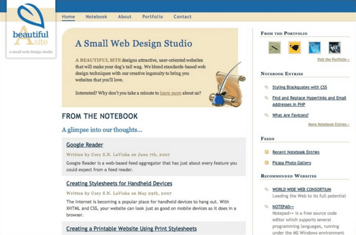

 <a href="../../index.html" class="nav-item">Home</a> <a href="../../tags/index.html" class="nav-item">Tags</a> <a href="../index.html" class="nav-item">Archive</a> <a href="../../about/index.html" class="nav-item">About</a>

---

# A Beautiful Site launched

April 29, 2007 • 1 min read

Heads up! This post was written in 2007, so it may contain information that is no longer accurate. I keep posts like this around for historical purposes and to prevent link rot, so please keep this in mind as you're reading.

— Cory

I'd like to introduce my new web design studio. After considering a list of potential names and designs, I finally came up with a name that I thought fitting for the kind of web design business that I want to run.

After a few pencil and paper sketches, a few hours in Photoshop, and a couple of late nights staring into two LCD monitors, A Beautiful Site was born.  
A Beautiful Site is built on a foundation of web standards, user-oriented design, and excellent development practices. These values follow through from the first keystroke to the final pixel. Pride is something that comes at no extra cost to our customers, and that's guaranteed.

So please feel free to look around. Read some articles, send us a message, or tell a friend about us. I can't wait to hear from you!

_Update: It's been awhile since this website first launched and things have changed quite a bit. Here's a glimpse of the original design from 2007._

<a href="../../tags/news/index.html" class="post-tag">news</a>

---

Written by [Cory LaViska](../../index-4.html), a software engineer and UX architect responsible for [Shoelace.style](https://shoelace.style/), [Surreal CMS](https://www.surrealcms.com/), and other [open source things](https://github.com/claviska).

You can follow Cory on [Twitter](https://twitter.com/bgooonz) and [GitHub](https://github.com/claviska).

---

<a href="../an-event-apart-boston/index.html" class="post-nav-next">Up next An Event Apart, Boston</a>
