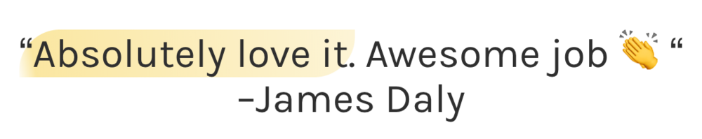
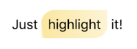

 <a href="../../index.html" class="nav-item">Home</a> <a href="../../tags/index.html" class="nav-item">Tags</a> <a href="../index.html" class="nav-item">Archive</a> <a href="../../about/index.html" class="nav-item">About</a>

---

# A clever way to style the &lt;mark&gt; element

February 01, 2019 • 1 min read

I was checking out the [CashNotify app](https://cashnotify.com/) today and I noticed a beautiful style for highlighting text in their testimonials:

Most textual highlights use a boring rectangle background color, but this stands out and looks gorgeous. I was really hoping they were using a simple `<mark>` tag to accomplish this and was happy to learn that they are. The markup is as simple as it could be:

    Just <mark>highlight</mark> it!

And the styles are simple too:

    mark {
      background: linear-gradient(-100deg, hsla(48,92%,75%,.3), hsla(48,92%,75%,.7) 95%, hsla(48,92%,75%,.1));
      border-radius: 1em 0;
      padding: .5rem;
    }

<a href="../../tags/design/index.html" class="post-tag">design</a>

---

Written by [Cory LaViska](../../index-4.html), a software engineer and UX architect responsible for [Shoelace.style](https://shoelace.style/), [Surreal CMS](https://www.surrealcms.com/), and other [open source things](https://github.com/claviska).

You can follow Cory on [Twitter](https://twitter.com/claviska) and [GitHub](https://github.com/claviska).

---

<a href="../opening-a-new-window-after-an-async-operation/index.html" class="post-nav-previous">Previous post Opening a new window after an async operation</a> <a href="../getting-duplicate-ids-in-an-html-document/index.html" class="post-nav-next">Up next Getting duplicate ids in an HTML document</a>
