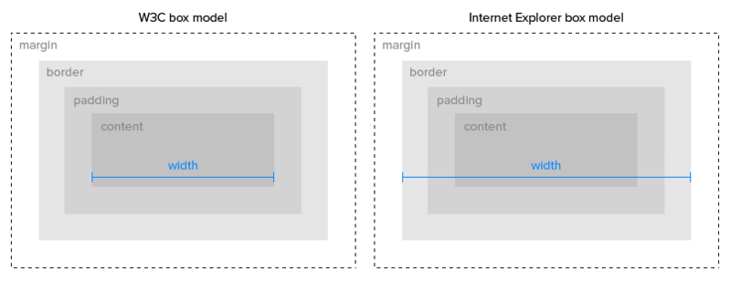
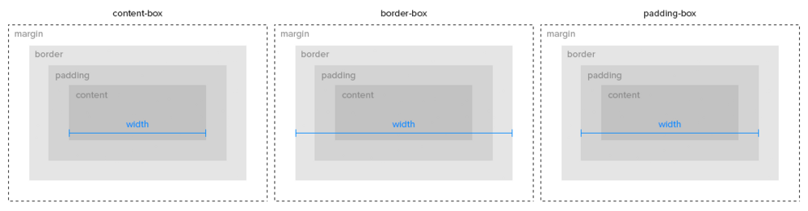

 <a href="../../index.html" class="nav-item">Home</a> <a href="../../tags/index.html" class="nav-item">Tags</a> <a href="../index.html" class="nav-item">Archive</a> <a href="../../about/index.html" class="nav-item">About</a>

---

# box-sizing: border-box explained

August 08, 2014 • 2 min read

It's been over two years since Paul Irish [famously posted](http://www.paulirish.com/2012/box-sizing-border-box-ftw/) the box-sizing trick that would bring us back to the days of early Internet Explorer.

## The good ol' days <a href="#the-good-ol&#39;-days" class="direct-link">#</a>

You might remember how Internet Explorer 6 (quirks mode) and below did that whole [box model thing](http://en.wikipedia.org/wiki/Internet_Explorer_box_model_bug) wrong. If not, here's a refresher.

You might even remember what a pain it was to develop with. We're not talking about the days of [conditional comments](http://www.sitepoint.com/web-foundations/internet-explorer-conditional-comments/), we're talking about the days of horrible CSS hacks littering stylesheets. You know, like this one:

    div {
        width: 100px;
    }
    div {
        \width: 140px;
        w\idth: 100px;
    }

This hack tricked older versions of Internet Explorer in such a way that the `div` would be the same width in IE and W3C-compliant browsers. (I don't think I need to go into detail about why this was a bad idea.)

The funny thing is, we've more or less come full circle to the very model we were fighting against. You see, the `border-box` trick actually brings us back to the way old IE worked. And it's glorious. There's even [a special day](http://css-tricks.com/international-box-sizing-awareness-day/) for it.

## How it works <a href="#how-it-works" class="direct-link">#</a>

The `border-box` trick effectively changes the way dimensions are measured for every element so it includes borders and padding. Here's the code, for reference:

    *,
    html {
      box-sizing: border-box;
    }
    *, *:before, *:after {
      box-sizing: inherit;
    }

Think of it as a box model reset that will make you enjoy writing CSS. It's a tried and tested method that works all the way back to IE8, and is used in popular frameworks such as [Bootstrap](http://getbootstrap.com/). There are no performance issues—it's like a little piece of magic on your webpage.

## But some of my plugins look funny now <a href="#but-some-of-my-plugins-look-funny-now" class="direct-link">#</a>

I've noticed this a few times before. If you're using a third party plugin whose styles rely on the `content-box` model, things might look a bit strange. To fix this, you can create an override class or apply the following styles directly to a parent element of the plugin:

    .content-box,
    .content-box * {
      box-sizing: content-box;
    }

This resets the container and everything inside to the default `box-sizing` model, so third-party plugins will render correctly.

## Pick your box model <a href="#pick-your-box-model" class="direct-link">#</a>

The two most common values for `box-sizing` are `border-box` and `content-box`, but another has been introduced more recently. As it's name implies, `padding-box` measures the element's width, height, and padding but not its border. (Support for the new property [isn't great yet](http://caniuse.com/css3-boxsizing), so avoid using it for anything serious.)

To better understand each property, here's a diagram for reference.

Oh, and before you ask: no, [there's no margin-box](http://stackoverflow.com/questions/10808413/css3-box-sizing-margin-box-why-not).

<a href="../../tags/design/index.html" class="post-tag">design</a> <a href="../../tags/html/index.html" class="post-tag">html</a>

---

Written by [Cory LaViska](../../index-4.html), a software engineer and UX architect responsible for [Shoelace.style](https://shoelace.style/), [Surreal CMS](https://www.surrealcms.com/), and other [open source things](https://github.com/claviska).

You can follow Cory on [Twitter](https://twitter.com/bgooonz) and [GitHub](https://github.com/claviska).

---

<a href="../give-your-jpegs-alpha-channels/index.html" class="post-nav-previous">Previous post Give your JPEGs alpha channels</a> <a href="../playcanvas-an-easy-open-source-webgl-game-engine/index.html" class="post-nav-next">Up next PlayCanvas: an easy, open source WebGL game engine</a>
