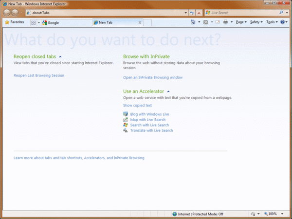
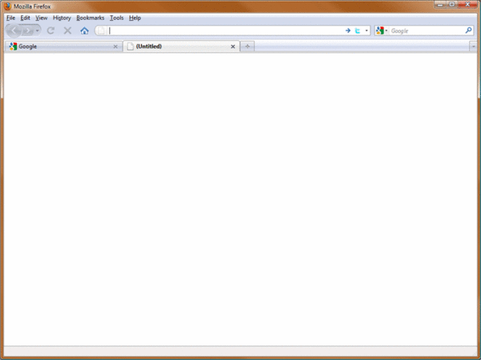
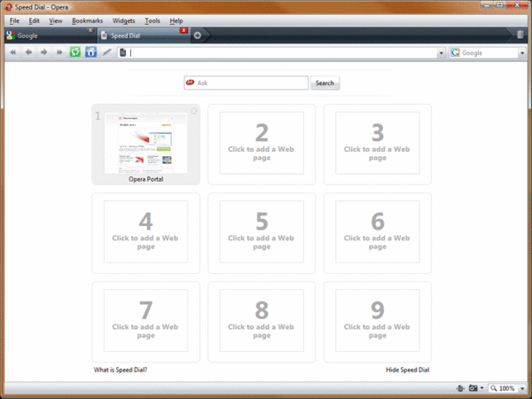
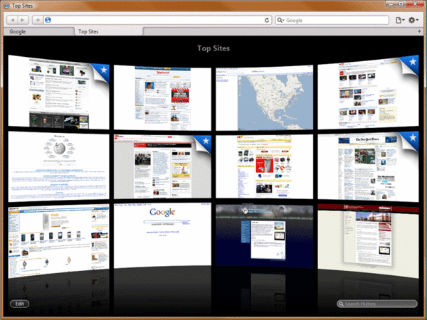

 <a href="../../index.html" class="nav-item">Home</a> <a href="../../tags/index.html" class="nav-item">Tags</a> <a href="../index.html" class="nav-item">Archive</a> <a href="../../about/index.html" class="nav-item">About</a>

------------------------------------------------------------------------

Browser makers: where’s the new tab + homepage option?
======================================================

August 07, 2009 • 3 min read

Heads up! This post was written in 2009, so it may contain information that is no longer accurate. I keep posts like this around for historical purposes and to prevent link rot, so please keep this in mind as you're reading.

— Cory

Ever since tabbed browsing hit the mainstream I've been hooked. It's rare to see less than a handful of tabs open in my web browser at any time. Whether I'm developing, checking email, or just surfing around, I can never seem to have enough tabs! But there's one thing about this incredible feature that has really bugged me since Day One — one that seems to have gone completely unnoticed by all of the browser makers to-date.

> Why can't I see my homepage when I open a new tab?

It may seem trivial or silly to complain about, but to me the idea of anything but my homepage opening in a new tab is counterintuitive. For example, if you open a brand new browser window what do you expect to see? Your homepage. If you open any browser (before Safari 4, Opera 9.2, and Google Chrome) what do you expect to see? Your homepage.

People generally know what to do when they see their homepage because it's familiar to them. Most of them know how to use the address bar to go to another website. Many of them know how to choose a bookmark to quickly get to their favorite places on the web. For the majority of people, having their homepage open up in a new tab is simply what they subconsciously expect to happen.

The tragedy here is that this isn't currently possible in any browser without the use of a [plug-in](https://addons.mozilla.org/en-US/firefox/addon/777).

It seems as though browser makers each have their own perspective on what should happen when a new tab is opened. Internet Explorer 8, for example, likes to confuse its users with a mostly empty page to stare at. To spice it up a bit, Microsoft decided to add some infrequently used options that users can click on. How many times have you opened up a new tab because you wanted to "Blog with Windows Live" or "Map \[something\] with Live Search"? How about "Show copied text"?

These are clearly not options that are useful to users, but considering how well they promote Microsoft's services, I can understand how they got there.

Firefox is my browser of choice for both development and day-to-day browsing, but sadly, it doesn't do much better than IE when it comes to new tabs. In fact, I think it does even worse in comparison with IE8. It's a completely blank page.

If I'm not mistaken, Opera was the first to come out with the "smart page" when they introduced [Speed-Dial](http://en.wikipedia.org/wiki/Features_of_the_Opera_web_browser#Speed_Dial) in 9.2. Speed Dial allows users to specify up to nine websites from their bookmarks that will appear in a grid for easy access.

It wasn't long before other browser makers started trying out their own versions of smart pages. Google Chrome made their smart page more useful by adding a search bar, recent bookmarks, and recently closed tabs. As far as smart pages go, this is probably the best of the bunch for functionality, although the nine websites that are automatically chosen aren't always relevant to your actual use of them.

Finally, Safari 4 introduced a really slick "Top Sites" smart page that works pretty well. And, as usual with Apple products, it looks great. The only problem is that it's a little too flashy where it should be more functional. For example, click on the Search History box. The page is instantly replaced by a huge, side-scrolling list of websites. Sure it looks nice at first, but as I search through possible results, I can only see one at a time and it's very jumpy during transitions. I prefer Firefox's searchable history over this any day.

So where do we go from here? Will the world stop because we can't open new tabs and see our homepages? Of course not. It hasn't yet, and we've been dealing with it for years. But why? To me, this seems like a no-brainer that should have made the top of the list for possible "new tab candidates". At the very least, I'd like to see the browser makers add this in as an option somewhere.

<a href="../../tags/browsers/index.html" class="post-tag">browsers</a> <a href="../../tags/rants/index.html" class="post-tag">rants</a>

------------------------------------------------------------------------

Written by [Cory LaViska](../../index-4.html), a software engineer and UX architect responsible for [Shoelace.style](https://shoelace.style/), [Surreal CMS](https://www.surrealcms.com/), and other [open source things](https://github.com/claviska).

You can follow Cory on [Twitter](https://twitter.com/claviska) and [GitHub](https://github.com/claviska).

------------------------------------------------------------------------

<a href="../what-happens-if-ie8-breaks-my-website/index.html" class="post-nav-previous">Previous post What happens if IE8 "breaks" my website?</a> <a href="../table-cells-and-max-widths-in-internet-explorer-8/index.html" class="post-nav-next">Up next Table cells and max-widths in Internet Explorer 8</a>
