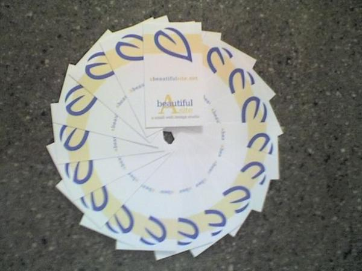

 <a href="../../index.html" class="nav-item">Home</a> <a href="../../tags/index.html" class="nav-item">Tags</a> <a href="../index.html" class="nav-item">Archive</a> <a href="../../about/index.html" class="nav-item">About</a>

---

# Business cards

April 29, 2007 • 1 min read

Heads up! This post was written in 2007, so it may contain information that is no longer accurate. I keep posts like this around for historical purposes and to prevent link rot, so please keep this in mind as you're reading.

— Cory

[VistaPrint](http://vistaprint.com/) delivered 1,000 “A Beautiful Site” business cards the other day, and I couldn't resist playing with them.

I decided to go conservative with the design, relying a bit on curiosity to draw attention to the business. Nevertheless, I am pleased with the way they turned out.

<a href="../../tags/news/index.html" class="post-tag">news</a>

---

Written by [Cory LaViska](../../index-4.html), a software engineer and UX architect responsible for [Shoelace.style](https://shoelace.style/), [Surreal CMS](https://www.surrealcms.com/), and other [open source things](https://github.com/claviska).

You can follow Cory on [Twitter](https://twitter.com/bgooonz) and [GitHub](https://github.com/claviska).

---

<a href="../an-event-apart-boston/index.html" class="post-nav-previous">Previous post An Event Apart, Boston</a> <a href="../gif-jpeg-or-png-using-images-on-the-web/index.html" class="post-nav-next">Up next GIF, JPEG or PNG? Using images on the web</a>
