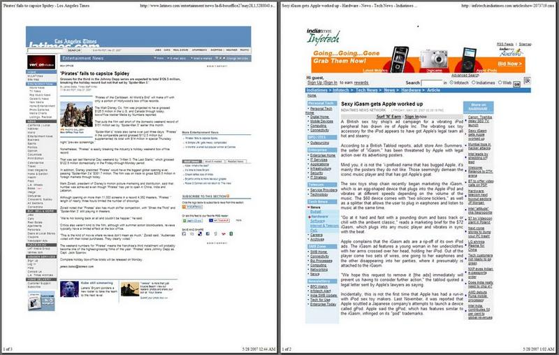
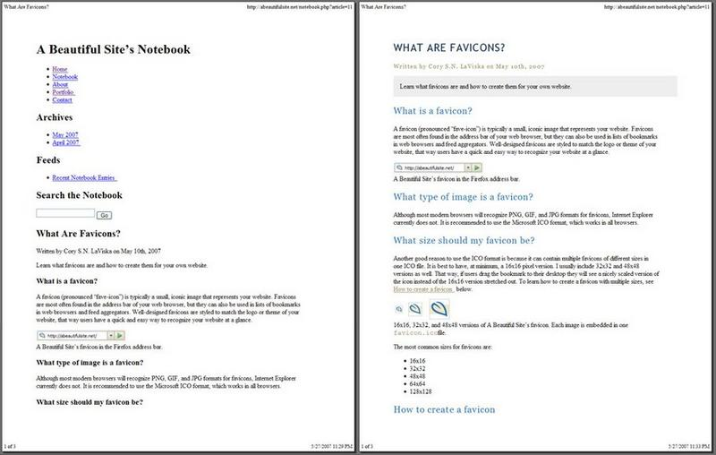

 <a href="../../index.html" class="nav-item">Home</a> <a href="../../tags/index.html" class="nav-item">Tags</a> <a href="../index.html" class="nav-item">Archive</a> <a href="../../about/index.html" class="nav-item">About</a>

------------------------------------------------------------------------

Creating a printable website using print stylesheets
====================================================

May 28, 2007 • 4 min read

Heads up! This post was written in 2007, so it may contain information that is no longer accurate. I keep posts like this around for historical purposes and to prevent link rot, so please keep this in mind as you're reading.

— Cory

I frequently see little printer icons all over the web that clearly mean I can print out a clean version of the webpage that I'm looking at. These little icons are indeed a beautiful sight from the user's perspective. No more having to modify printer settings or copy and paste certain content areas into a word processing program just to get it on paper. In fact, I used to be quite the fan of printable versions on the web until I realized what a pain it can be to develop them.

One method I've seen involves creating a separate version of each page that doesn't have the header, footer, and navigational elements. By doing this, one could nearly double the size of their website without even trying, and who knows how many people are actually going to print all those pages. It seems like a wasted effort, if you ask me.

A somewhat better method that a lot of database-driven websites use is to create a separate version of the content dynamically. This involves using a special page to generate a printable version of the content, again without the header, footer, and navigational elements. This is a lot better because it doesn't involve duplicating content on extra, unnecessary webpages. It still requires, however, extra effort to develop that special page to render the printable content; and who's to say that all the data is coming from just one table in the database? Another potential development nightmare.

To add insult to injury, both of the aforementioned methods result in the user dealing with an annoying pop-up window or being redirected to the printable version of the page. Oftentimes I thought to myself, "why can't I just hit CTRL+P and print this?" That would be the ultimate user experience. After all, if nothing else is consistent in web browsers it's the ability to click on `File | Print` to print a webpage. "This has to be possible", I thought. There must be a way to prevent content from printing like this:

Enter print stylesheets <a href="#enter-print-stylesheets" class="direct-link">#</a>
------------------------------------------------------------------------------------

With the web standards revolution going at full force, more and more people are understanding the need for semantic markup and stylesheets. The benefits are many compared to what little old-fashioned development techniques have to offer. In fact, there are [millions of articles](http://www.google.com/search?q=the+benefits+of+web+standards) on the web that outline the very benefits I'm referring to.

This article will cover one aspect of standard CSS that is becoming more and more popular in everyday development practice: print stylesheets.

A new way of printing <a href="#a-new-way-of-printing" class="direct-link">#</a>
--------------------------------------------------------------------------------

When I began developing A Beautiful Site's Notebook, one of the things I really wanted people to be able to do was print the articles. After all, what good is an article if you can't print it out and take it with you? Another thing I wanted was for the printouts to look clean and professional, which is what I ultimately achieved. If you don't believe me, print this page and see for yourself. I think the before & after results are rather convincing:

Notice how the version without print styles has the website title, navigation menu, and sidebar content cluttering up the first half of the page? In the styled version, these elements are removed and the page almost looks as if it were printed from a word processing program. The font styles and sizes still match that of the original design, with one exception: I decided to style the main text as `Times New Roman`, since serif fonts are easier to read on printed media. Most books and magazines use this style of font, so it should give readers a more comfortable feeling when reading the article on paper.

Note that, compared to the previous examples, the non-styled version of A Beautiful Site's webpages are still clean and easy to read. One of the benefits of using semantic markup means that, print styles or not, your pages will be more legible when they come out of the printer.

Minimal effort <a href="#minimal-effort" class="direct-link">#</a>
------------------------------------------------------------------

### Linking the print stylesheet <a href="#linking-the-print-stylesheet" class="direct-link">#</a>

It really doesn't take much time and effort to apply this technology to your website. In fact, all you need to do is create an additional stylesheet and link each page to it. I typically add this line directly below the normal stylesheet link:

    <link href="your_print_style.css" rel="stylesheet" type="text/css" media="print" />

Notice that the `media` attribute is set to `print` instead of `screen`.

That was easy, now we need to create `your_print_style.css`.

### Creating the print stylesheet <a href="#creating-the-print-stylesheet" class="direct-link">#</a>

You could simply start from scratch and attempt to recreate the entire look and feel of your site in a printable version. Considering the amount of time it would probably take to do this, it seems rather silly to start from the ground up. My technique for creating print stylesheets is much faster and easier.

First, I copy the normal stylesheet to the new stylesheet. That's right, `select all` → `copy` → `paste`.

Second, I decide which elements I *don't* want to appear on the printed version. For this example, let's pretend we have the following elements: `header`, `nav-menu`, `sidebar`, `content`, and `footer`. The only essential element for the printed version will be `content`, which contains the information that the user is actually trying to print.

Next, I disable all of the unnecessary elements from appearing using standard CSS:

    #header,
    #nav-menu,
    #sidebar,
    #footer {
      display: none;
    }

Note: To avoid confusion, it's a good idea to delete or comment-out the old CSS that affects these elements.

The final step is to remove any styles that apply to the `content` element that may affect the way it appears in the printed version. This may include paddings, margins, borders, or anything else that hinders the appearance. If you're using a sans-serif font, you may also wish to style the main text as a serif font, as I did above.

### The final design <a href="#the-final-design" class="direct-link">#</a>

You can preview your design without having to print it out using the `Print Preview` feature in your browser. As with normal stylesheets, feel free to make any adjustments to your print stylesheet to optimize the appearance of the design. Now that you have beautiful, no-hassle, printed versions of your webpages, your users will thank you.

<a href="../../tags/design/index.html" class="post-tag">design</a> <a href="../../tags/css/index.html" class="post-tag">css</a>

------------------------------------------------------------------------

Written by [Cory LaViska](../../index-4.html), a software engineer and UX architect responsible for [Shoelace.style](https://shoelace.style/), [Surreal CMS](https://www.surrealcms.com/), and other [open source things](https://github.com/claviska).

You can follow Cory on [Twitter](https://twitter.com/bgooonz) and [GitHub](https://github.com/claviska).

------------------------------------------------------------------------

<a href="../css-drop-caps/index.html" class="post-nav-previous">Previous post CSS drop caps</a> <a href="../creating-stylesheets-for-handheld-devices/index.html" class="post-nav-next">Up next Creating stylesheets for handheld devices</a>
