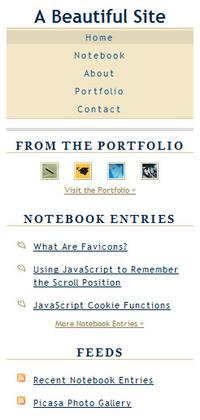
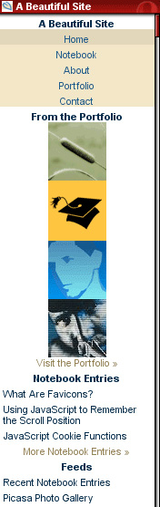

 <a href="../../index.html" class="nav-item">Home</a> <a href="../../tags/index.html" class="nav-item">Tags</a> <a href="../index.html" class="nav-item">Archive</a> <a href="../../about/index.html" class="nav-item">About</a>

------------------------------------------------------------------------

Creating stylesheets for handheld devices
=========================================

May 30, 2007 • 3 min read

Heads up! This post was written in 2007, so it may contain information that is no longer accurate. I keep posts like this around for historical purposes and to prevent link rot, so please keep this in mind as you're reading.

— Cory

It's not uncommon so see someone surfing the net with their cell phone or PDA these days or, at least, trying to. Unfortunately, portable technologies still have a long way to go before they conquer the web with their tiny screens. The good news is that, with a little help from stylesheets, your website can look presentable even in the palm of somebody's hand!

Handheld stylesheets <a href="#handheld-stylesheets" class="direct-link">#</a>
------------------------------------------------------------------------------

Similar to the way that [print stylesheets](http://abeautifulsite.net/notebook.php?article=16) make your webpages ready for paper, handheld stylesheets make your webpages ready for portable devices. This is often necessary due to the fact that most websites aren't designed for small screens. Fortunately, with a little extra effort, this obstacle is easy to overcome.

### Linking the handheld stylesheet <a href="#linking-the-handheld-stylesheet" class="direct-link">#</a>

We start off by linking to what will become our handheld stylesheet:

    <link href="your_handheld_style.css" rel="stylesheet" type="text/css" media="handheld" />

Notice how the `media` attribute is set to `handheld` instead of `screen`.  
Now it's time to create `your_handheld_style.css`.

### Creating the handheld stylesheet <a href="#creating-the-handheld-stylesheet" class="direct-link">#</a>

You could use the normal screen stylesheet as a starting point to make your handheld stylesheet. Depending on the complexity of the CSS, it may be better to start from scratch or just copy and paste one section at a time, modifying the styles little by little and testing as you go. You could even choose to make a completely different look and feel for the handheld version of your website. The key thing to remember here is that you're creating a design that is meant to display on small screens, often no larger than 240x320 pixels.

Which ever route you take, the fact that you will eventually need to preview the "portable" version of your website is inescapable...but what if you don't have a handheld device?

Testing the handheld stylesheet without a handheld device <a href="#testing-the-handheld-stylesheet-without-a-handheld-device" class="direct-link">#</a>
--------------------------------------------------------------------------------------------------------------------------------------------------------

### Using the Opera web browser <a href="#using-the-opera-web-browser" class="direct-link">#</a>

There are a lot of features I really love about [Opera](http://www.opera.com/), one of them being the *Small screen* feature. By clicking on `View` → `Small screen` or by pressing Shift + F11, you can preview any website in a simulated "handheld" mode. This is usually how I test my handheld stylesheets when I don't have a portable device laying around:

During testing in *Small screen* mode, it may be helpful to add the following code to your stylesheet. This will simulate the screen width of many common portable devices. Just remember to remove it before you upload!

    html {
      width: 240px;
      border: solid 1px #000000;
    }

Another thing I would recommend using in your handheld stylesheet is this:

    * { max-width: 100%; }

This will prevent elements such as images and textareas from exceeding the width of the device's screen.

### Using Opera Mini <a href="#using-opera-mini" class="direct-link">#</a>

Another method to test your handheld stylesheet is with [Opera Mini](http://www.operamini.com/). The program itself requires a mobile phone, but no worries! There's also an [online simulator](http://www.operamini.com/demo/?url=http://abeautifulsite.net) you can try out on any website. Here is what A Beautiful Site looks like on it:

A note about handheld stylesheets <a href="#a-note-about-handheld-stylesheets" class="direct-link">#</a>
--------------------------------------------------------------------------------------------------------

An important thing to remember while you're coding up a handheld stylesheet is the fact that most handhelds *will not* display your site exactly the way you intend them to. It sounds kind of ironic that you just spent the time writing up a completely different stylesheet just to find out that it's not going to work on the media you intended it to work on. Well, all is not lost. Let me explain...

Due to hardware and software limitations, most handheld devices are designed to display certain elements of webpages in ways that work for both the device and the user. For example, it wouldn't be of much use if a PDA with a screen resolution of 240x320 pixels displayed a full-size image that was 800x600 pixels. In most cases, the device will automatically scale the image down so the entire image can be viewed. Similar adjustments are made to text, links, form elements, floated elements, etc.

So what good is a handheld stylesheet if they aren't really supported? Well, they provide a foundation for the design which you *intend* the portable version of your website to have. Not only that, support for handheld stylesheets is growing rapidly as technology advances. For the little time and effort they actually require to produce, I'd say they're worth the effort.

What if I don't have a handheld stylesheet? <a href="#what-if-i-don&#39;t-have-a-handheld-stylesheet%3F" class="direct-link">#</a>
----------------------------------------------------------------------------------------------------------------------------------

A good question indeed. Most portable browsers will either make a good attempt at using your normal stylesheet or ditch the styles altogether. The benefit of using handheld stylesheets is that you are, to some extent, guaranteed your website will reflect at least a little bit of the design which you intended.

The future of handheld stylesheets <a href="#the-future-of-handheld-stylesheets" class="direct-link">#</a>
----------------------------------------------------------------------------------------------------------

Some portable browsers, such as Opera Mini and Apple's anticipated iPhone version of Safari, do a fairly good job of rendering websites based on their default screen styles. Aside from the low resolutions that portable devices commonly suffer, it makes me wonder if handheld stylesheets will even be necessary in years to come. Since the path is still unclear, however, it can't really hurt to have them.

<a href="../../tags/design/index.html" class="post-tag">design</a> <a href="../../tags/css/index.html" class="post-tag">css</a>

------------------------------------------------------------------------

Written by [Cory LaViska](../../index-4.html), a software engineer and UX architect responsible for [Shoelace.style](https://shoelace.style/), [Surreal CMS](https://www.surrealcms.com/), and other [open source things](https://github.com/claviska).

You can follow Cory on [Twitter](https://twitter.com/bgooonz) and [GitHub](https://github.com/claviska).

------------------------------------------------------------------------

<a href="../creating-a-printable-website-using-print-stylesheets/index.html" class="post-nav-previous">Previous post Creating a printable website using print stylesheets</a> <a href="../web-standards-are-just-minor-details/index.html" class="post-nav-next">Up next Web standards are just "minor details"</a>
