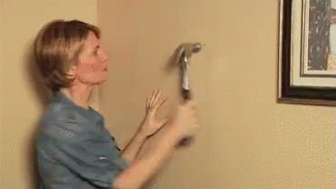

 <a href="../../index.html" class="nav-item">Home</a> <a href="../../tags/index.html" class="nav-item">Tags</a> <a href="../index.html" class="nav-item">Archive</a> <a href="../../about/index.html" class="nav-item">About</a>

---

# Don't Do Magic

October 11, 2021 • 3 min read

We recently had a design for an "alert" component with an `actions` slot. In the spec, only secondary buttons were allowed in it.

> Dev: "Design only wants secondary buttons in the actions slot, so I'm forcing it."

The developer was listening for the `slotchange` event and applying the `secondary` variant to all buttons in the slot automatically. The idea was to prevent consumers from using the wrong buttons by constraining the design in code. This magic will cause problems.

Here's the thing: designers change their minds. Sometimes a lot. They might _tell_ you that a design will never, ever change. They might swear to everything holy that it will never change. But it can and often will.

In this case, forcing a variant on slotted buttons changed them from:

    <my-button>

to:

    <my-button appearance="secondary">

Aside from being unexpected, it leaves the user with no obvious way to add anything other than a secondary button to the slot.

> "But that's what design wants!"

...until they realize they need a primary action button in that slot. Now you have to write code to account for this new requirement, PR it, get it reviewed, approved, and push a new version so they can use it. Problem solved, right?

Not so fast…

## Scopes Change <a href="#scopes-change" class="direct-link">#</a>

Turns out, another team is using the same component to prototype a new feature and they want to use all possible button variations. This isn't the use case the design team initially specced the component for, but it doesn't make sense to create one from scratch because this one is close enough. Due to time and cost constraints, management decides the existing component should be modified to support both use cases.

Boom. The design that won't change has changed.

But remember the magic we coded that forced all slotted buttons to be secondary buttons? Because of that, we have to introduce a breaking change in our alert component OR give users an alternate API that's inconsistent with how buttons already work. Neither option is great.

In my opinion, locking design choices down with code, or "magic," is an antipattern. It creates more work for devs, makes things less intuitive for users, and introduces tech debt that will haunt you later on.

> "Well then how do we force users to use the right buttons?"

We don't! That's not our job. Neither design nor engineering can account for every possible use case for the components we build.

Our job is to give users tools to build things with. If I give you a hammer and you smash a hole in the wall instead of tapping in a nail, that's a misuse of the tool.

## When Bulletproofing is Overengineering <a href="#when-bulletproofing-is-overengineering" class="direct-link">#</a>

As engineers, it can be tempting to make components "bulletproof" using ✨magic✨ code. This is usually an overstep. There are two things you shouldn't underestimate:

1.  The importance of design reviews
2.  Use cases that evolve over time

If you're not taking the time to do design reviews, do them! But don't wait until the very end. You'll have better success if design and engineering work together _throughout_ the process.

As for magic — I consider it a code smell. If you find yourself forcing things like this via code, that's a red flag. A better approach is good documentation! Show examples of approved use cases. Give users code to copy and paste. Make it easy for them to get it right.

Users will definitely do things they're not supposed to. Get comfortable with that and catch it in design reviews. Use these instances to understand _why_ they're doing it that way and work with design to iterate if necessary. These are great opportunities to learn from each other.

Don't assume users are dumb or just don't get it. Give them the tools they need and make it easy for them to succeed. Most importantly, listen to feedback and know when it's time to steer them away from incorrect usage vs. adapting the tooling for new requirements.

---

This post was originally [a series of tweets](https://twitter.com/bgooonz/status/1447562886314971141?s=20).

<a href="../../tags/design%20systems/index.html" class="post-tag">design systems</a> <a href="../../tags/web%20components/index.html" class="post-tag">web components</a> <a href="../../tags/html/index.html" class="post-tag">html</a> <a href="../../tags/css/index.html" class="post-tag">css</a> <a href="../../tags/javascript/index.html" class="post-tag">javascript</a>

---

Written by [Cory LaViska](../../index-4.html), a software engineer and UX architect responsible for [Shoelace.style](https://shoelace.style/), [Surreal CMS](https://www.surrealcms.com/), and other [open source things](https://github.com/claviska).

You can follow Cory on [Twitter](https://twitter.com/bgooonz) and [GitHub](https://github.com/claviska).

---

<a href="../on-buttons-and-links/index.html" class="post-nav-previous">Previous post On Buttons and Links</a> <a href="../know-when-to-draw-the-line/index.html" class="post-nav-next">Up next Know When To Draw The Line</a>
