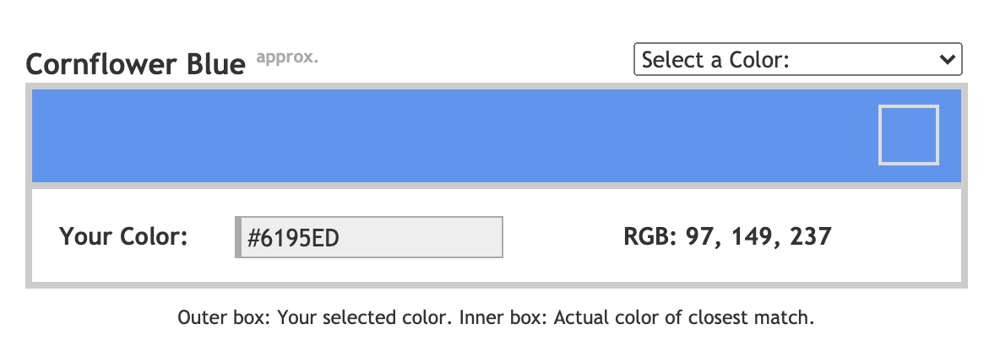

 <a href="../../index.html" class="nav-item">Home</a> <a href="../../tags/index.html" class="nav-item">Tags</a> <a href="../index.html" class="nav-item">Archive</a> <a href="../../about/index.html" class="nav-item">About</a>

---

# Find a name for almost any hex color

August 22, 2014 • 1 min read

Have you ever wondered what color that certain shade of blue is? Or maybe you've named your Less/Sass variables something like _gray_, _light gray_, _lighter gray_, etc. Here's a tool that will give you more reasonable names for all those colors.

[Name that Color](http://chir.ag/projects/name-that-color/) lets you enter a hex value (or choose one from the color picker) and gives you a human-readable name for the closest matching shade. There are over 1,500 color names available, ranging from _alabaster_ to _zinnwaldite_. Others are more common, such as _brick red_, _chocolate_, and _slate gray._ Even if you don't land on a perfect match, the nearest named-color is only a shade or two away.

The author also provided the [JavaScript library](http://chir.ag/projects/ntc/) behind it all under a Creative Commons license. It's really easy to use:

    // Find the nearest match
    var match = ntc.name("#6195ED");

    // The resulting array
    var closest = match[0]; // RGB value of the closest match
    var name    = match[1]; // The color name
    var exact   = match[2]; // True if it's an exact match

What will you do with this handy tool?

<a href="../../tags/design/index.html" class="post-tag">design</a> <a href="../../tags/css/index.html" class="post-tag">css</a> <a href="../../tags/tips/index.html" class="post-tag">tips</a>

---

Written by [Cory LaViska](../../index-4.html), a software engineer and UX architect responsible for [Shoelace.style](https://shoelace.style/), [Surreal CMS](https://www.surrealcms.com/), and other [open source things](https://github.com/claviska).

You can follow Cory on [Twitter](https://twitter.com/claviska) and [GitHub](https://github.com/claviska).

---

<a href="../working-with-html5-data-attributes/index.html" class="post-nav-previous">Previous post Working with HTML5 data attributes</a> <a href="../subtle-patterns-hundreds-of-free-backgrounds-that-tile/index.html" class="post-nav-next">Up next Subtle Patterns: hundreds of free backgrounds that tile</a>
