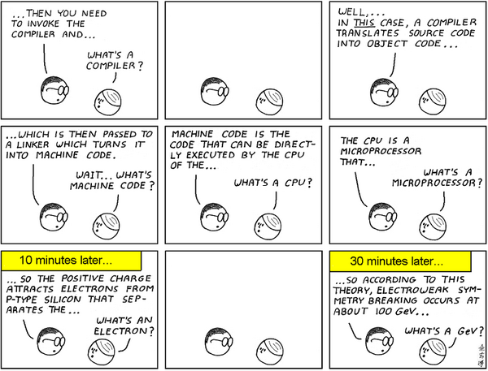

 <a href="../../index.html" class="nav-item">Home</a> <a href="../../tags/index.html" class="nav-item">Tags</a> <a href="../index.html" class="nav-item">Archive</a> <a href="../../about/index.html" class="nav-item">About</a>

------------------------------------------------------------------------

Get comfortable with abstraction
================================

February 18, 2015 • 1 min read

I stumbled across [a tweet](https://twitter.com/ossia/status/565907210497040384/photo/1) the other day and it's been resonating in my mind ever since. Mostly because it's something I tend to have a problem with.

You see, I have this thing where I try really hard to understand exactly how something works—all the way down to the last nut and bolt. Deep down I know that those details are usually irrelevant. But it bothers me to know there are things that I don't know.

I have a problem with abstraction.

So I'm posting this comic as a reminder for myself to look beyond the details and focus on the big picture. Maybe you'll enjoy reading it too.

*Comic courtesy of [Abtruse Goose](http://abstrusegoose.com/98)*

<a href="../../tags/development/index.html" class="post-tag">development</a>

------------------------------------------------------------------------

Written by [Cory LaViska](../../index-4.html), a software engineer and UX architect responsible for [Shoelace.style](https://shoelace.style/), [Surreal CMS](https://www.surrealcms.com/), and other [open source things](https://github.com/claviska).

You can follow Cory on [Twitter](https://twitter.com/bgooonz) and [GitHub](https://github.com/claviska).

------------------------------------------------------------------------

<a href="../thoughts-on-being-a-good-manager/index.html" class="post-nav-previous">Previous post Thoughts on being a good manager</a> <a href="../the-html5-download-attribute/index.html" class="post-nav-next">Up next The HTML5 download attribute</a>
