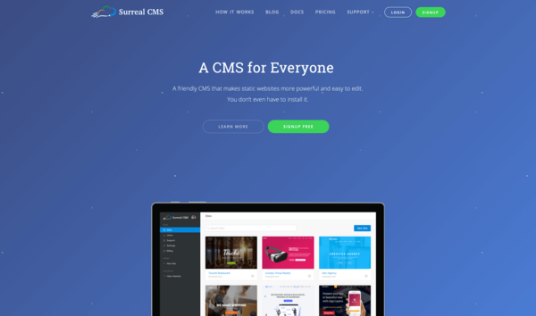

 <a href="../../index.html" class="nav-item">Home</a> <a href="../../tags/index.html" class="nav-item">Tags</a> <a href="../index.html" class="nav-item">Archive</a> <a href="../../about/index.html" class="nav-item">About</a>

------------------------------------------------------------------------

Introducing Surreal CMS 7
=========================

April 26, 2019 • 1 min read

Last November was the 10 year mark for [Surreal CMS](https://www.surrealcms.com/), a content management service I created to manage static (and mostly static) websites.

Last week, [I soft launched Surreal CMS 7](https://www.surrealcms.com/blog/announcing-surreal-cms-7.html). This new version is a complete rebuild from scratch using Node.js + Vue.js. I worked on this new app for a long time, and I'm incredibly happy with the result.

Everything has been improved in this version, and there's a bunch of great new features that really make static websites fun to manage. Early feedback from new and existing users has been overwhelmingly positive!

**I've also reintroduced the free plan** for personal, educational, and non-profit users!

The list of updates and improvements is way too long to list here, but you can check out the [official announcement](https://www.surrealcms.com/blog/announcing-surreal-cms-7.html) to learn more.

<a href="../../tags/news/index.html" class="post-tag">news</a>

------------------------------------------------------------------------

Written by [Cory LaViska](../../index-4.html), a software engineer and UX architect responsible for [Shoelace.style](https://shoelace.style/), [Surreal CMS](https://www.surrealcms.com/), and other [open source things](https://github.com/claviska).

You can follow Cory on [Twitter](https://twitter.com/claviska) and [GitHub](https://github.com/claviska).

------------------------------------------------------------------------

<a href="../getting-duplicate-ids-in-an-html-document/index.html" class="post-nav-previous">Previous post Getting duplicate ids in an HTML document</a> <a href="../lets-encrypt-renews-but-browsers-still-seeing-oldexpired-ssl-certificate/index.html" class="post-nav-next">Up next Let's Encrypt renews but browsers still seeing old/expired SSL certificate</a>
