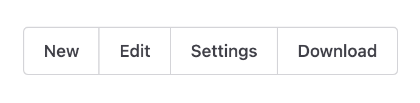
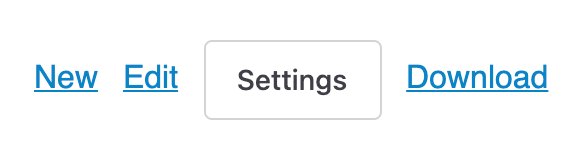

 <a href="../../index.html" class="nav-item">Home</a> <a href="../../tags/index.html" class="nav-item">Tags</a> <a href="../index.html" class="nav-item">Archive</a> <a href="../../about/index.html" class="nav-item">About</a>

------------------------------------------------------------------------

On Buttons and Links
====================

October 06, 2021 • 4 min read

I posted a tweet yesterday that was met with some controversy, so I thought it would be a good idea to unravel it.

> Unpopular opinion: in a design system, a "link" and a "button" should be one component.
>
> — Cory LaViska (@claviska) [October 5, 2021](https://twitter.com/bgooonz/status/1445479402532261892?ref_src=twsrc%5Etfw)

At face value, I understand why people are upset with this. It's hard to provide context in 280 characters, though, so [I made it a thread](https://twitter.com/bgooonz/status/1445479402532261892). That was a mistake, because people don't always read the thread so the intent gets lost and assumptions get made. Twitter is a wonderful place.

Semantically Different <a href="#semantically-different" class="direct-link">#</a>
----------------------------------------------------------------------------------

Let's start by stating the obvious. A button and a link are [semantically different HTML elements](https://www.webaxe.org/proper-use-buttons-links/), so no need to bust out the keyboard to tell me that. The idea of merging the two into a single component comes from real world experience working on multiple design system teams for large companies.

The fact is that designers always, always ask for links that look like buttons and buttons that look like links. I know, [designers shouldn't do this](https://twitter.com/oliverturner/status/1445724464860127244?s=20). But this isn't a fantasy, it's our reality, and [when it costs your organization measurable value](https://twitter.com/bgooonz/status/1445722314889437184) in terms of conversions, sales, etc., you're not going to win that argument.

Emotions aside, this often leads to developers producing two separate [button](https://explore.fast.design/components/fast-button) and [link](https://explore.fast.design/components/fast-anchor) components with the same styles and logic, and consumers end up misusing them just like `<button>` and `<a>`.

To alleviate this, [I propose that a custom element](https://twitter.com/bgooonz/status/1445480631832436747) such as `<my-button>` should render the same "button" visually, but based on the presense of an optional `href` attribute, it will use a `<button>` or an `<a>` under the hood.

    <my-button>Save</my-button>
    <!-- 👉 <button class="button button--primary">Save</button> -->

    <my-button href="/new">New</my-button>
    <!-- 👉 <a class="button button--primary" href="/new">New</a> -->

This makes it more foolproof — if it goes somewhere, it becomes a link. If not, it's remains a button. So far, we're more or less aligned with the Twittersphere…[except for one detail](https://twitter.com/EmmaJ_PR/status/1445664177821925387?s=20):

*They should look different because they should do different things.*

Visually Different? <a href="#visually-different%3F" class="direct-link">#</a>
------------------------------------------------------------------------------

As much as I want to agree with this statement, it falls apart in practice. *Links will inevitably need to look like buttons from time to time.* No, buttons and links are not *semantically* the same, but there are times when they need to be *visually* the same.

In web apps, the function of buttons and links is often blended. Some actions, such as "new," might simply open a new page. Others aren't as obvious. "Save" might fire off an [XHR](https://developer.mozilla.org/en-US/docs/Web/API/XMLHttpRequest) and redirect you to another page if the response is successful — or go nowhere and show an error if the response fails.

Suddenly, the line between "button" and "link" is more blurry. Should it still be a link if it takes me somewhere only *after* an XHR is successful? What if the request errors out and doesn't redirect? What if you click a link and the app prevents navigation because you have unsaved changes? There are so many scenarios and "what ifs" that, in practice, it's hard to settle on a 100% agreeable definition.

And then comes the design team with a Figma for the app's toolbar.

We'll assume that "New" takes you to `/new` and "Edit" takes you to `/edit/:id`. Those should definitely be links! But wait — "Settings" doesn't go anywhere. It just opens up a dialog, so it needs to be a button. And instead of creating an endpoint on the server that downloads the file, we'll use the [`download`](https://developer.mozilla.org/en-US/docs/Web/HTML/Element/a#attr-download) attribute so that also needs to be a link.

Let's adjust the design to account for the idea that buttons and links *must* be visually different.

Do you think the design team is going to be thrilled with these changes to the toolbar? Do you think your customers will prefer this toolbar over the previous one?

What Users Expect <a href="#what-users-expect" class="direct-link">#</a>
------------------------------------------------------------------------

If the user is presented with a set of actions, *they don't care if you use buttons or links under the hood*. They care that it's consistent and that each control does what it's supposed to do. Remember that in all cases, each control's action is clearly inferred from its label.

Whether clicking "Delete" takes the user to a new page to confirm or opens a dialog to confirm is irrelevant. To the user, they're all just "buttons" that do something.\*

It is true that links and buttons have different behaviors and the decision to make them look visually similar should be carefully considered. For example, CMD or CTRL + click typically opens a link in a new window. When buttons and links are identical, it can put users at a disadvantage.

I would recommend *not* making buttons and links look the same if you can reasonably expect the user will desire such behaviors. Some environments are more predictable than others. But accessibility isn't binary, so thought and consideration is still required from both design and development regardless of your approach.

Enforcement via API <a href="#enforcement-via-api" class="direct-link">#</a>
----------------------------------------------------------------------------

The suggestion I'm making enforces the semantic definition of "button" and "link" by leaning on API design to ensure DRY principles and remove the burden of thought from consumers. This solves the problem of when to use a link or button under the hood.

It does not answer the question of "*should buttons and links be visually similar*?" That's a topic I'd love to have a conversation about because there are plenty of use cases that suggest at least sometimes they should.

Just know that, if you're working on a design system, it's extremely likely you will come across this requirement!

------------------------------------------------------------------------

\*This doesn't mean you should throw the baby out with the bathwater. It just means there might be situations where you need to use a link as a button, and the user doesn't care as long as it works. The download example comes do mind.

<a href="../../tags/accessibility/index.html" class="post-tag">accessibility</a> <a href="../../tags/css/index.html" class="post-tag">css</a> <a href="../../tags/javascript/index.html" class="post-tag">javascript</a> <a href="../../tags/design%20systems/index.html" class="post-tag">design systems</a>

------------------------------------------------------------------------

Written by [Cory LaViska](../../index-4.html), a software engineer and UX architect responsible for [Shoelace.style](https://shoelace.style/), [Surreal CMS](https://www.surrealcms.com/), and other [open source things](https://github.com/claviska).

You can follow Cory on [Twitter](https://twitter.com/bgooonz) and [GitHub](https://github.com/claviska).

------------------------------------------------------------------------

<a href="../on-using-web-component-libraries/index.html" class="post-nav-previous">Previous post On Using Web Component Libraries</a> <a href="../dont-do-magic/index.html" class="post-nav-next">Up next Don't Do Magic</a>
