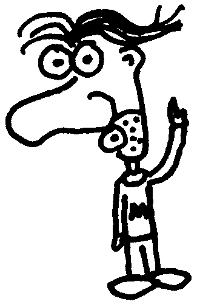

 <a href="../../index.html" class="nav-item">Home</a> <a href="../../tags/index.html" class="nav-item">Tags</a> <a href="../index.html" class="nav-item">Archive</a> <a href="../../about/index.html" class="nav-item">About</a>

------------------------------------------------------------------------

PHP functions to get and remove the file extension from a string
================================================================

March 12, 2009 • 1 min read

Heads up! This post was written in 2009, so it may contain information that is no longer accurate. I keep posts like this around for historical purposes and to prevent link rot, so please keep this in mind as you're reading.

— Cory

I use these regular expressions all the time, but it's much more convenient to have them both in convenient PHP functions.

    // Returns only the file extension (without the dot)
    function file_ext($filename) {
      return preg_match('/\./', $filename) ? preg_replace('/^.*\./', '', $filename) : '';
    }

    // Returns the file name minus its extension
    function file_ext_strip($filename){
      return preg_replace('/.[^.]*$/', '', $filename);
    }

You can also use the built-in [`pathinfo`](http://php.net/manual/en/function.pathinfo.php) function to achieve the same result:

    $filename = '/path/to/file.ext';

    echo pathinfo($filename)['extension']; // "ext"
    echo pathinfo($filename)['filename']; // "file"

<a href="../../tags/development/index.html" class="post-tag">development</a> <a href="../../tags/php/index.html" class="post-tag">php</a> <a href="../../tags/tips/index.html" class="post-tag">tips</a>

------------------------------------------------------------------------

Written by [Cory LaViska](../../index-4.html), a software engineer and UX architect responsible for [Shoelace.style](https://shoelace.style/), [Surreal CMS](https://www.surrealcms.com/), and other [open source things](https://github.com/claviska).

You can follow Cory on [Twitter](https://twitter.com/bgooonz) and [GitHub](https://github.com/claviska).

------------------------------------------------------------------------

<a href="../prevent-white-noise-from-appearing-in-images-after-fading/index.html" class="post-nav-previous">Previous post Prevent white noise from appearing in images after fading</a> <a href="../images-display-in-firefox-and-safari-but-not-in-internet-explorer/index.html" class="post-nav-next">Up next Images display in Firefox and Safari, but not in Internet Explorer</a>
