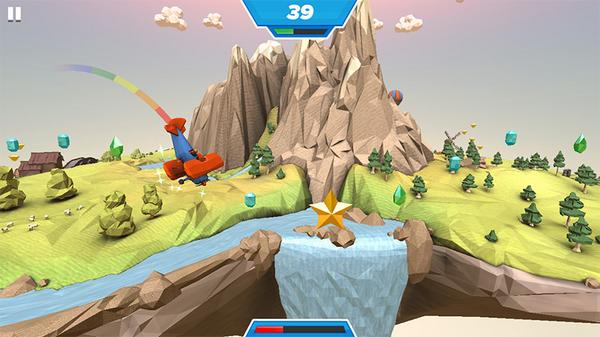

 <a href="../../index.html" class="nav-item">Home</a> <a href="../../tags/index.html" class="nav-item">Tags</a> <a href="../index.html" class="nav-item">Archive</a> <a href="../../about/index.html" class="nav-item">About</a>

------------------------------------------------------------------------

PlayCanvas: an easy, open source WebGL game engine
==================================================

August 11, 2014 • 1 min read

Last week I wrote about [faster JavaScript animations](../../faster-javascript-animations-with-velocityjs/index.html) using VelocityJS. As if that wasn't impressive enough, today I'm giving you a dose of HTML5 and WebGL greatness.

The project is called [PlayCanvas](https://playcanvas.com/), and it dubs itself an open source game engine that brings fun to the web.

> PlayCanvas is the world’s easiest to use WebGL Game Engine. It’s free, it’s open source and it’s backed by amazing developer tools.

It also boasts partnerships with Mozilla, Activision, and ARM. How's that for momentum?

So what's the big deal? Here's yet another great example of where the web and HTML is going. What started as a simple markup language has evolved into a platform for just about anything you can imagine. Take [Swooop](http://apps.playcanvas.com/playcanvas/swooop/swooop) for example, a game built with PlayCanvas whose graphics and gameplay had me convinced I was playing a Nintendo Wii.

The game isn't elaborate—it was made to demonstrate what you can do with PlayCanvas, but it's stunning nevertheless. You navigate a biplane collecting jewels, stars, and fuel while avoiding clouds and other hazards. The plane circles a three dimensional island full of trees, houses, waterfalls, and rocks. In the distances there's even a windmill and a hot air balloon floating around. Here's an actual screenshot I took while playing:

Want to try it yourself? You can [play Swooop right now](https://playcanv.as/p/JtL2iqIH/) or explore some of the other [user-contributed games](https://playcanvas.com/explore). Of course, many of these are unpolished games with simple objectives, so don't expect Xbox quality here. Think of it as a proof-of-concept.

Cool, right? Here's one last gem for you: [Lego Gangnam Style](https://playcanv.as/p/NIbWnGY4/).

You may laugh, but pretty soon we'll be seeing entire movies in HTML/WebGL—we might even be able to make our own.

<a href="../../tags/development/index.html" class="post-tag">development</a> <a href="../../tags/javascript/index.html" class="post-tag">javascript</a> <a href="../../tags/resources/index.html" class="post-tag">resources</a>

------------------------------------------------------------------------

Written by [Cory LaViska](../../index-4.html), a software engineer and UX architect responsible for [Shoelace.style](https://shoelace.style/), [Surreal CMS](https://www.surrealcms.com/), and other [open source things](https://github.com/claviska).

You can follow Cory on [Twitter](https://twitter.com/claviska) and [GitHub](https://github.com/claviska).

------------------------------------------------------------------------

<a href="../box-sizing-border-box-explained/index.html" class="post-nav-previous">Previous post box-sizing: border-box explained</a> <a href="../how-to-get-the-dominant-colors-of-an-image-with-color-thief/index.html" class="post-nav-next">Up next How to get the dominant colors of an image with Color Thief</a>
