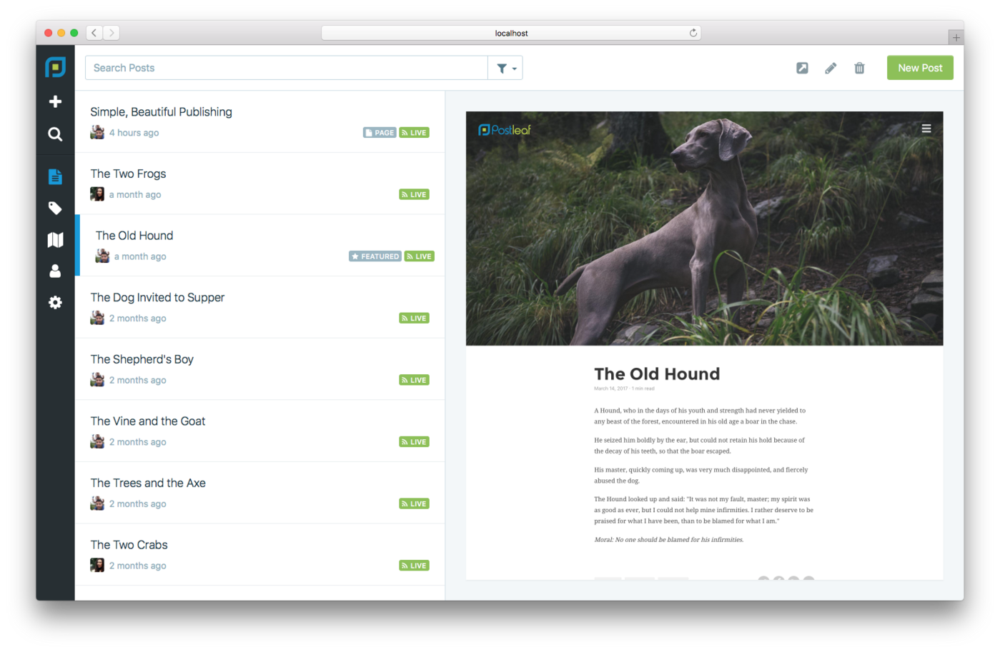

 <a href="../../index.html" class="nav-item">Home</a> <a href="../../tags/index.html" class="nav-item">Tags</a> <a href="../index.html" class="nav-item">Archive</a> <a href="../../about/index.html" class="nav-item">About</a>

------------------------------------------------------------------------

Postleaf: reimagined
====================

April 26, 2017 • 1 min read

It's been about nine months since Postleaf debuted as a simple, beautiful, open source, PHP blogging platform. The initial version was well-received, landing [an article on TechCrunch](https://techcrunch.com/2016/08/23/postleaf-is-a-open-source-blogging-platform-for-the-design-conscious/) and making its way to [\#1 for the day on Product Hunt](https://www.producthunt.com/posts/postleaf). (Thank you so much, everyone!)

Today, I'm announcing something pretty big: *A complete redesign, a new platform, and some amazing new features.*

From the Ground Up <a href="#from-the-ground-up" class="direct-link">#</a>
--------------------------------------------------------------------------

Postleaf has been redesigned from the ground up. I've moved the project to Node.js, refined the user interface, and added a number of incredible features that just work:

-   Inline editing
-   Distraction-free ("zen") mode with day and night support
-   Automatic responsive images via Dynamic Images
-   Themes via Dust.js
-   Fast, database-agnostic built-in search
-   Integrated file manager
-   Out of the box support for JSON-LD, OpenGraph, and Twitter Cards
-   oEmbed support for embedding third-party content
-   Spotlight-style search from anywhere in the admin panel
-   Simple backups (including content as easy-to-read JSON files, themes, and uploads in a single zip file)
-   Custom post templates (no limit to how many a theme can have)
-   Roles and permissions
-   And more

Everything you loved about the old version of Postleaf is still there and then some. And it's even more simple and beautiful than before.

You can [get the source](https://github.com/Postleaf/postleaf/releases) of the new version on GitHub.

<a href="../../tags/news/index.html" class="post-tag">news</a> <a href="../../tags/postleaf/index.html" class="post-tag">postleaf</a>

------------------------------------------------------------------------

Written by [Cory LaViska](../../index-4.html), a software engineer and UX architect responsible for [Shoelace.style](https://shoelace.style/), [Surreal CMS](https://www.surrealcms.com/), and other [open source things](https://github.com/claviska).

You can follow Cory on [Twitter](https://twitter.com/claviska) and [GitHub](https://github.com/claviska).

------------------------------------------------------------------------

<a href="../thoughts-on-uploads/index.html" class="post-nav-previous">Previous post Thoughts on uploads</a> <a href="../json-feed/index.html" class="post-nav-next">Up next JSON Feed</a>
