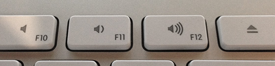

 <a href="../../index.html" class="nav-item">Home</a> <a href="../../tags/index.html" class="nav-item">Tags</a> <a href="../index.html" class="nav-item">Archive</a> <a href="../../about/index.html" class="nav-item">About</a>

---

# Smaller volume increments in macOS

August 13, 2014 • 1 min read

Ever wish you turn the volume up or down just a tiny bit more on your Mac? Well, you can.

You already know you can increase and decrease your Mac's volume with the keyboard, but sometimes the intervals are a bit too much. I usually end up adjusting my external speakers just to get that perfect volume. But that's silly. There's a better way to fine-tune your volume without leaving the keyboard.

Simply pressing option + shift + volume up/down will result in quarter intervals, which means you can achieve that perfect volume without having to do secondary adjustments.

What other hidden features of OS X have you come across? Give me something post-worthy and I'll write about it and credit you in the article.

<a href="../../tags/macos/index.html" class="post-tag">macos</a> <a href="../../tags/tips/index.html" class="post-tag">tips</a>

---

Written by [Cory LaViska](../../index-4.html), a software engineer and UX architect responsible for [Shoelace.style](https://shoelace.style/), [Surreal CMS](https://www.surrealcms.com/), and other [open source things](https://github.com/claviska).

You can follow Cory on [Twitter](https://twitter.com/claviska) and [GitHub](https://github.com/claviska).

---

<a href="../link-to-a-specific-page-in-a-pdf-file/index.html" class="post-nav-previous">Previous post Link to a specific page in a PDF file</a> <a href="../what-is-my-browser-this-tool-will-tell-you/index.html" class="post-nav-next">Up next What is my browser? This tool will tell you</a>
