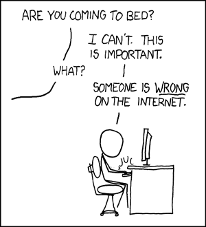

 <a href="../../index.html" class="nav-item">Home</a> <a href="../../tags/index.html" class="nav-item">Tags</a> <a href="../index.html" class="nav-item">Archive</a> <a href="../../about/index.html" class="nav-item">About</a>

---

# Thoughts on comments

June 12, 2016 • 3 min read

For as long as I can remember, comments have been a staple of blogging software. After all, what's a good blog post without a relevant discussion to accompany it?

You might find it strange to learn that Postleaf doesn't ship with comments. This is by design, and I'll explain why in this post.

## The Comment Problem <a href="#the-comment-problem" class="direct-link">#</a>

Everyone thinks they want comments on their blog. That is, until they have to deal with the problems that those comments create. The biggest problem is by far comment spam. This is such a huge issue that the makers of WordPress established [a dedicated service](https://akismet.com/) just to fight it.

But why does it happen? Well, spammers post bogus comments, those comments contain links, and those links make them money when people click. Since it costs them practically nothing to do it, they keep posting comment spam. A lot of it.

## Fighting Spam <a href="#fighting-spam" class="direct-link">#</a>

There are many ways to fight comment spam. One is to moderate all comments before they go public. This really sucks because comments don't go live immediately and you have to manually approve every single one. That makes it hard to have a discussion and it can fill up your inbox.

Another approach is to add some kind of crazy [CAPTCHA](https://en.wikipedia.org/wiki/CAPTCHA) test to your comment form, but these can be difficult even for humans and often discourage visitors from leaving comments.

Perhaps the most effective approach is to require users to create an account, verify their email address, and then let them post. But let's be honest, how many people are actually going to take the time to do that? In my experience, not very many. Most people aren't comfortable typing their email address into a web form, so they're probably not going to give you their name, email address, and a password.

## Everyone Has An Opinion <a href="#everyone-has-an-opinion" class="direct-link">#</a>

Yes, everyone. And many of them feel invincible hiding behind their keyboard so they're not afraid to force that opinion down your throat in the comments. Which brings us to the next big problem with comments: _accountability_.

Even if you force users to create an account before posting a comment, there's nothing stopping them from using a bogus name and email address. You're going to end up with a lot of flaming, trash talking, and senseless discussions because there's a huge lack of accountability on the Internet.

So how do we fix that? Well, I could spend the next year trying to develop the perfect comment system for Postleaf, but it's a massive undertaking and, to be honest, it would probably never really be good enough.<https://xkcd.com/233/>

So what now? Do we ditch comments altogether? 🤔

## A Better Way <a href="#a-better-way" class="direct-link">#</a>

Some time ago, I got tired of dealing with comment problems and disabled them on my blog. The conversation went quiet, and I started to feel alone in the world. (Ok, not really, but still, not allowing comments at all was pretty lame.)

Eventually, I decided to try out [Disqus](https://disqus.com/). I added a small JavaScript snippet to my website and BOOM, comments. But not just any comments, good comments.

### Why Disqus Works <a href="#why-disqus-works" class="direct-link">#</a>

The power of Disqus is in its community. Users login to their Disqus account (which they can create from your site if they don't already have one) and they're able to post comments to your blog.

You're probably wondering, "how is this any different from letting them create an account on _my_ website?"

It's very different, because they only need to create one account which can be used on any website that runs Disqus. You have immediate access to millions of registered users that you don't have to bother keeping track of. Furthermore, Disqus lets users login through Facebook, Twitter, or Google, which provides the best form of accountability you're going to get on the Internet.

Since I started using Disqus, I haven't had to deal with comment spam and the conversation has been just that — a conversation. Disqus handles notifications so I know when people post comments and they know when I respond. I can even reply to notifications with various commands to moderate comments by email — a huge time saver! 📫

_Update: February 26, 2017_

As of February 2017, Disqus converted their free plan into an ad-supported plan. That means, unless you remove Disqus from your website or fork up $10 per month, your website is going to show ads.

I'm in no way opposed to a SaaS making money, but this feels like a bait and switch. Nobody gets to opt out. Nobody gets grandfathered in. You either pay up, stop using Disqus, or your visitors get subjected to whatever ads Disqus wants to show on your website.

Not having control over one's own website is something I'm vehemently against.

## Comments in Postleaf <a href="#comments-in-postleaf" class="direct-link">#</a>

Comments shouldn't be a chore. They should form relevant, civil discussions that engage your visitors. When you spend all your time moderating comments, you end up with less time for the finer things in life.

That's why I intentionally left comments out of the Postleaf core. If you want them, I suggest finding a third-party platform or service that suits your needs for now. They are absolutely the best way to promote relevant discussions on your blog without the hassle of dealing with traditional comments.

<a href="../../tags/postleaf/index.html" class="post-tag">postleaf</a>

---

Written by [Cory LaViska](../../index-4.html), a software engineer and UX architect responsible for [Shoelace.style](https://shoelace.style/), [Surreal CMS](https://www.surrealcms.com/), and other [open source things](https://github.com/claviska).

You can follow Cory on [Twitter](https://twitter.com/claviska) and [GitHub](https://github.com/claviska).

---

<a href="../code-can-change/index.html" class="post-nav-previous">Previous post Code can change</a> <a href="../dont-hate-on-php/index.html" class="post-nav-next">Up next Don't hate on PHP</a>
