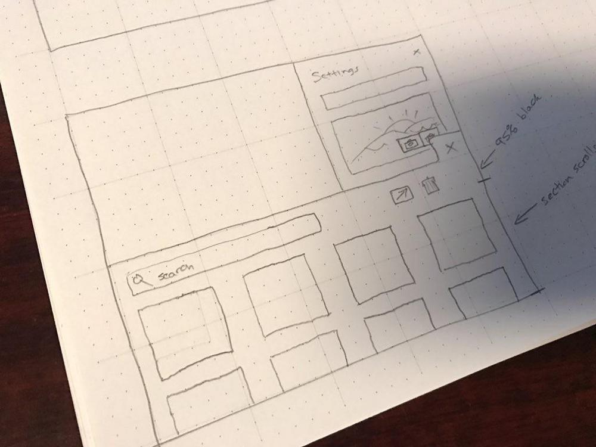
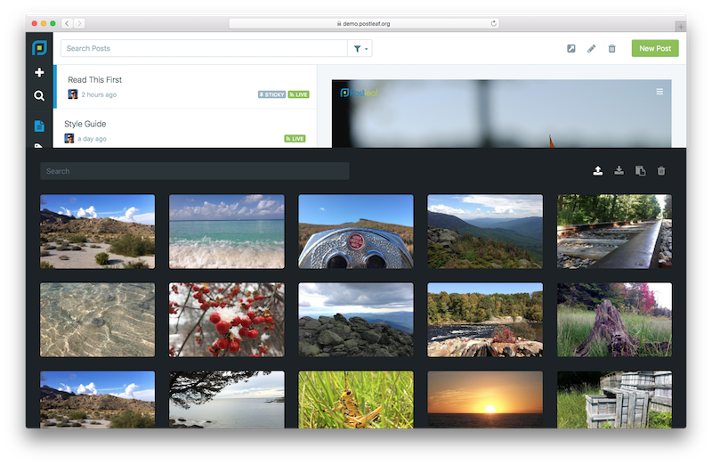

 <a href="../../index.html" class="nav-item">Home</a> <a href="../../tags/index.html" class="nav-item">Tags</a> <a href="../index.html" class="nav-item">Archive</a> <a href="../../about/index.html" class="nav-item">About</a>

---

# Thoughts on uploads

March 21, 2017 • 1 min read

Uploads management is a concept I've always struggled with in Postleaf, but it's a necessary evil. Users have to be able to view and delete files they upload; but at the same time, I've never felt that it should be an integral part of the app.

Last night I had to face the fact that Postleaf isn't going to ship until it has a damn good uploads manager.

It was time to face the inevitable. I stayed up [all night](https://twitter.com/postleafapp/status/844069264621559808) on a sort of [vision quest](https://www.youtube.com/watch?v=FbccrO8qKog) for ideas, and ultimately came up with what I feel is the perfect solution for Postleaf.

The concept involves a panel that slides up from the bottom of the screen when the control is activated. Images and other files are displayed in lightbox-style gallery, along with the ability to search, delete, and download files. The panel can be dismissed by clicking or tapping outside of it or by pressing the escape key.

I created this concept because I don't believe the uploads manager deserves its own dedicated section in the admin panel. People use Postleaf to manage content, not files, so let's stay focused on what we came here to do.

Managing files is a secondary task, and this panel approach suits it well. The uploads manager can be accessed from anywhere in the app by pressing CMD + SHIFT + U. Alternatively, it can be activated by a form control and used as a file picker.

Here's a glimpse of an early prototype:

I chose a dark background because it brings more focus to your photos and files. I think it works really well, and I'm excited to bring this concept to life in Postleaf.

At this rate, I should have the uploads manager ready to roll in a couple days!

<a href="../../tags/postleaf/index.html" class="post-tag">postleaf</a> <a href="../../tags/design/index.html" class="post-tag">design</a>

---

Written by [Cory LaViska](../../index-4.html), a software engineer and UX architect responsible for [Shoelace.style](https://shoelace.style/), [Surreal CMS](https://www.surrealcms.com/), and other [open source things](https://github.com/claviska).

You can follow Cory on [Twitter](https://twitter.com/bgooonz) and [GitHub](https://github.com/claviska).

---

<a href="../importing-plain-css-files-with-sass/index.html" class="post-nav-previous">Previous post Importing plain CSS files with Sass</a> <a href="../postleaf-reimagined/index.html" class="post-nav-next">Up next Postleaf: reimagined</a>
