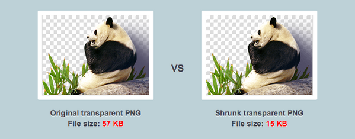

 <a href="../../index.html" class="nav-item">Home</a> <a href="../../tags/index.html" class="nav-item">Tags</a> <a href="../index.html" class="nav-item">Archive</a> <a href="../../about/index.html" class="nav-item">About</a>

---

# TinyPNG: A better way to compress PNG images

August 15, 2014 • 1 min read

By now, you know that optimizing images and other resources can reduce bandwidth and help your website load faster. Perhaps you've even used a tool like [Pngcrush](http://pmt.sourceforge.net/pngcrush/) before to make your images smaller. Now, there's an even better solution.

[TinyPNG](https://tinypng.com/) uses "smart lossy compression techniques" to make your images smaller. _But wait, isn't PNG a lossless format?_ Yes, and that's the beauty of TinyPNG:

> By selectively decreasing the number of colors in the image, fewer bytes are required to store the data. The effect is nearly invisible but it makes a very large difference in file size!

To accomplish this, TinyPNG uses a [quantization](<http://en.wikipedia.org/wiki/Quantization_(image_processing)>) algorithm to reduce the number of colors in a way that's virtually undetectable to the naked eye. This is the same technique that [Color Thief](../how-to-get-the-dominant-colors-of-an-image-with-color-thief/index.html) uses to generate color palettes from photos.

Here's how it works in more detail:

> When you upload a PNG (Portable Network Graphics) file, similar colors in your image are combined. This technique is called “quantization”. Because the number of colors is reduced, 24-bit PNG files can be converted to much smaller 8-bit indexed color images. All unnecessary metadata is stripped too. The result: tiny PNG files with 100% support for transparency.

And here's a before/after comparison:

It's visually the same, but 74% smaller. Of course, this percentage will vary for each image. I've been using TinyPNG quite a bit lately and haven't found a single instance where the results were unacceptable.

While using their website is free, there are some paid options for TinyPNG. Instead of dropping your images onto their page, you can get the [TinyPNG Photoshop plugin](https://tinypng.com/photoshop) for $40. There's also a [developer API](https://tinypng.com/developers) with both free and paid plans. (If you want a Bash script that uses their API, [here's one](https://github.com/RanyAlbegWein/Tinypng) by [@RanyAlbegWein](https://twitter.com/ranyalbegwein).)

What other techniques do you use to make images smaller? Share them with me below!

<a href="../../tags/images/index.html" class="post-tag">images</a> <a href="../../tags/design/index.html" class="post-tag">design</a> <a href="../../tags/tips/index.html" class="post-tag">tips</a>

---

Written by [Cory LaViska](../../index-4.html), a software engineer and UX architect responsible for [Shoelace.style](https://shoelace.style/), [Surreal CMS](https://www.surrealcms.com/), and other [open source things](https://github.com/claviska).

You can follow Cory on [Twitter](https://twitter.com/bgooonz) and [GitHub](https://github.com/claviska).

---

<a href="../what-is-my-browser-this-tool-will-tell-you/index.html" class="post-nav-previous">Previous post What is my browser? This tool will tell you</a> <a href="../using-the-classlist-api/index.html" class="post-nav-next">Up next Using the classList API</a>
